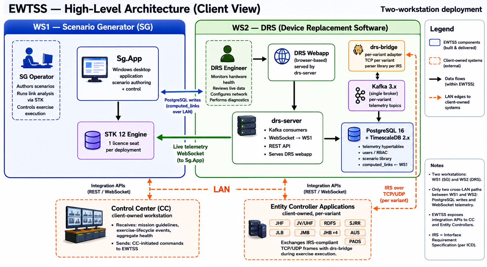
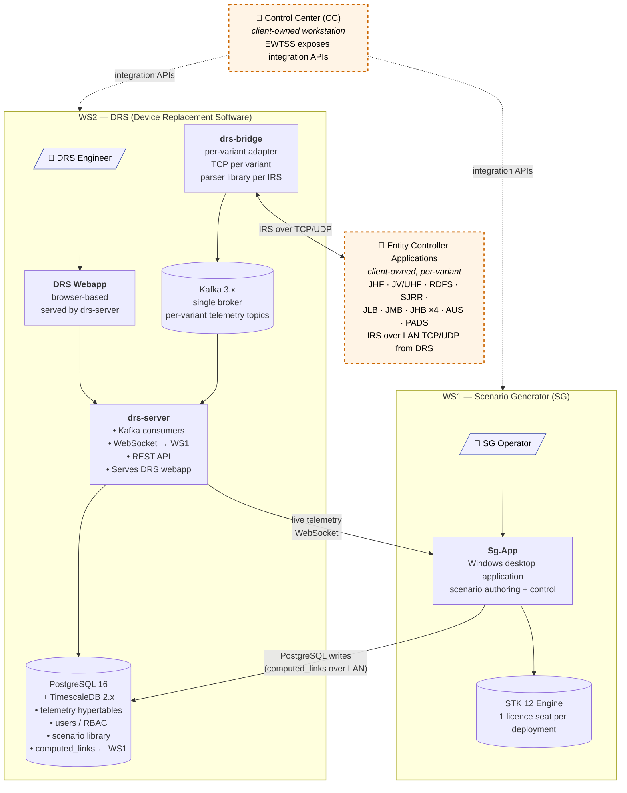

# EWTSS — High-Level Architecture Diagram

**Purpose:** high-level architecture diagram for the EWTSS system. Shows the deployed shape — two workstations, the components running on each, the personas who use them, the data flows between them, and the systems EWTSS integrates with at the LAN boundary.

This is a deployment view.

> A PNG render of the diagram lives alongside this file at [`ewtss_high_level_architecture_diagram.png`](ewtss_high_level_architecture_diagram.png) for embedding in slide decks, PDFs, and other client deliverables. The Mermaid block in §1 is the source of truth — when the PNG and the Mermaid disagree, the Mermaid is authoritative and the PNG should be re-rendered.

---

## 1. Architecture diagram (Mermaid)

### Reading the diagram

- **Two workstations** comprise an EWTSS deployment: **WS1** runs the Scenario Generator surface (Sg.App + STK 12); **WS2** runs the Device Replacement Software services + a browser-based engineer surface.
- **Two personas** are explicitly modelled:
  - **SG Operator** — authors scenarios, runs link analysis via STK, controls exercise execution. Works on WS1 through `Sg.App`.
  - **DRS Engineer** — monitors hardware health, reviews per-variant live data, configures hardware IP / network parameters, performs diagnostics. Works on WS2 through the DRS webapp (browser-based).
- **Solid borders** = components that EWTSS builds and ships as part of the delivery.
- **Dashed orange borders** = client-owned systems that EWTSS integrates with at the LAN boundary. EWTSS exposes APIs; EWTSS does not own the consumer side.
  - **Control Center (CC)** — receives mission guidelines + exercise-lifecycle events + aggregate health from EWTSS; can issue CC-initiated commands back to EWTSS.
  - **Entity Controller Applications** — per-variant client-owned apps that exchange IRS-compliant TCP/UDP frames with `drs-bridge` during exercise execution. *IRS* here refers to the Interface Requirement Specification — the runtime wire protocol for each hardware variant, defined by that variant's Interface Control Document (ICD).
- **Solid arrows** = data flows present in every deployment.
- **Dashed orange arrows** = LAN edges to client-owned systems.
- **The split point is the message bus + database on WS2.** Cross-LAN traffic between the two workstations is limited to two paths:
  - `Sg.App` (WS1) writes link-analysis results to PostgreSQL on WS2.
  - `drs-server` (WS2) streams live telemetry to `Sg.App` (WS1) via WebSocket.

---

## 2. Redraw specification (for the PNG owner)

If the diagram is being maintained in a separate diagramming tool (draw.io, Lucidchart, PowerPoint, Visio) for client deliverables, apply these settings to keep the PNG in sync with the Mermaid above.

### 2.1 Boxes / nodes

| ID | Box label | Inside which group | Style |
|---|---|---|---|
| **N1** | "SG Operator" 👤 persona icon | WS1 subgraph | Persona — light-blue fill, blue stroke |
| **N2** | "**Sg.App** — Windows desktop application — scenario authoring + control" | WS1 subgraph | Standard internal — solid black border |
| **N3** | "STK 12 Engine — 1 licence seat per deployment" cylinder/database shape | WS1 subgraph | Standard internal |
| **N4** | "DRS Engineer" 👤 persona icon | WS2 subgraph | Persona — light-blue fill, blue stroke |
| **N5** | "**DRS Webapp** — browser-based — served by drs-server" | WS2 subgraph | Standard internal — solid black border |
| **N6** | "**drs-server** — Kafka consumers / WebSocket → WS1 / REST API / Serves DRS webapp" | WS2 subgraph | Standard internal — solid black border |
| **N7** | "**drs-bridge** — per-variant adapter — TCP per variant — parser library per IRS" | WS2 subgraph | Standard internal — solid black border |
| **N8** | "Kafka 3.x — single broker — per-variant telemetry topics" cylinder shape | WS2 subgraph | Standard internal |
| **N9** | "PostgreSQL 16 + TimescaleDB 2.x — telemetry hypertables / users / RBAC / scenario library / `computed_links` ← WS1" cylinder/database shape | WS2 subgraph | Standard internal |
| **N10** | 🔌 "Control Center (CC) — *client-owned workstation* — EWTSS exposes integration APIs" | Standalone external (outside WS1 + WS2) | **Dashed orange border, light-orange fill** |
| **N11** | 🔌 "Entity Controller Applications — *client-owned, per-variant* — JHF · JV/UHF · RDFS · SJRR · JLB · JMB · JHB ×4 · AUS · PADS — IRS over LAN TCP/UDP from DRS" | Standalone external (outside WS1 + WS2) | **Dashed orange border, light-orange fill** |

### 2.2 Subgraphs / grouping

- **WS1 (Scenario Generator)** — solid blue border / light-blue fill. Title: "WS1 — Scenario Generator (SG)". Contains N1–N3.
- **WS2 (DRS workstation)** — solid green border / light-green fill. Title: "WS2 — DRS (Device Replacement Software)". Contains N4–N9.
- **External cluster** (optional grouping for visual clarity) — N10 and N11 sit outside both subgraphs, ideally to the left of WS1 (for CC, since CC sits between SG and the rest of the LAN) and to the right or below WS2 (for Entity Controllers, since drs-bridge sends IRS to them).

### 2.3 Edges / arrows

| ID | From → To | Label | Style |
|---|---|---|---|
| **E1** | N1 (SG Operator) → N2 (Sg.App) | (no label — implicit) | Solid arrow |
| **E2** | N2 → N3 (STK Engine) | (no label) | Solid arrow |
| **E3** | N4 (DRS Engineer) → N5 (DRS Webapp) | (no label) | Solid arrow |
| **E4** | N5 → N6 (drs-server) | (no label) | Solid arrow |
| **E5** | N7 (drs-bridge) → N8 (Kafka) | "publish" | Solid arrow |
| **E6** | N8 → N6 | "consume" | Solid arrow |
| **E7** | N6 → N9 (PostgreSQL/TimescaleDB) | "write" | Solid arrow |
| **E8** | N2 (Sg.App) → N9 | "PostgreSQL writes (`computed_links` over LAN)" | Solid arrow, **crosses workstation boundary** |
| **E9** | N6 → N2 | "live telemetry (WebSocket)" | Solid arrow, **crosses workstation boundary** |
| **E10** | N10 (CC) ↔ WS1 group | "integration APIs" | **Dashed orange arrow, bidirectional** |
| **E11** | N10 (CC) ↔ WS2 group | "integration APIs" | **Dashed orange arrow, bidirectional** |
| **E12** | N7 (drs-bridge) ↔ N11 (Entity Controllers) | "IRS over TCP/UDP" | **Dashed orange arrow, bidirectional** |

### 2.4 Visual conventions

- **Solid borders** = inside the EWTSS deliverable (EWTSS builds and ships these components).
- **Dashed orange borders + light-orange fill** = client-owned, integration boundary; EWTSS exposes APIs but does not own the consumer.
- **Solid arrows** = data flows present in every deployment.
- **Persona icons** (👤) attached to the surface they primarily interact with.
- A small **legend** in a corner is recommended explaining external (dashed orange) vs in-scope (solid).
