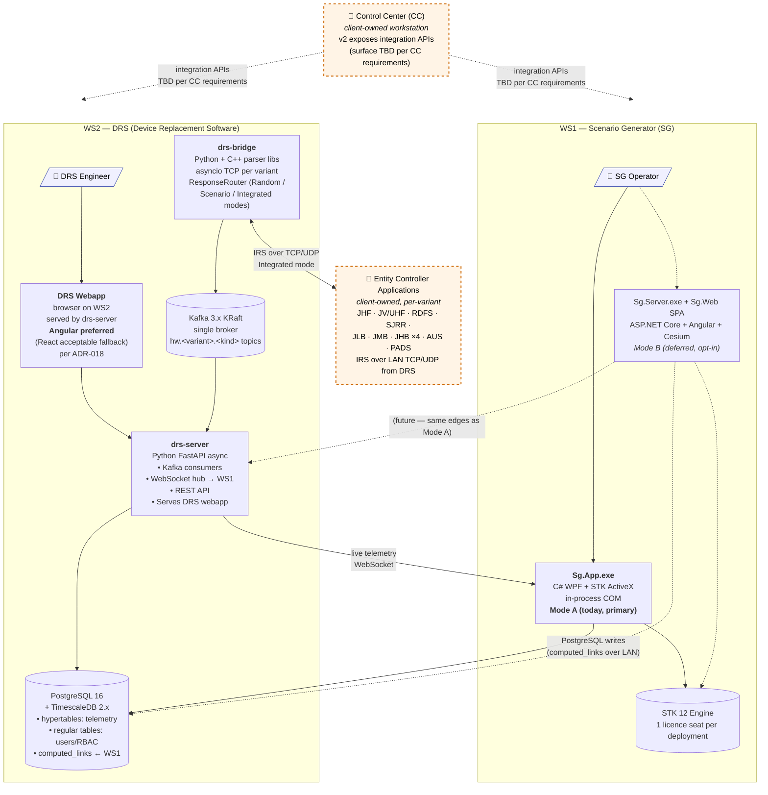

# EWTSS v2 — High-Level Architecture Diagram

**Purpose:** the canonical, version-controlled source for the high-level architecture diagram. The Mermaid block below renders directly in GitHub and is the authoritative "what does v2 look like" picture as of the most recent commit. The binary PNG (`ewtss_v2_high_level_architecture_diagram.png` in this directory) is a generated artefact and may lag behind this source; when they disagree, **this Mermaid is authoritative**.

This doc is intended for two readers:
1. **Anyone reading the doc set** — the Mermaid renders inline and shows the current architecture.
2. **Whoever owns the PNG source** (typically a draw.io / Lucidchart / PowerPoint file outside the repo) — §2 below is a redraw specification they can apply.

---

## 1. Architecture diagram (Mermaid — renders in GitHub)

### Reading the diagram

- **Solid borders** = inside v2 development scope.
- **Dashed orange borders** (CC, Entity Controller Applications) = client-owned, integration boundary; v2 exposes APIs, does not own the consumer side. Per [ADR-018](decision-record.md#adr-018--ws2-drs-webapp-required-browser-frontend-on-the-drs-workstation-served-by-drs-server) and [Architecture Overview §3.10](architecture-overview.md#310-external-integrations-out-of-v2-development-scope-).
- **Solid arrows** = data flows present in every deployment.
- **Dashed grey arrows** = future / deferred (Mode B).
- **Two personas** are explicitly modelled: SG Operator on WS1 (uses `Sg.App`) and DRS Engineer on WS2 (uses the DRS webapp via a local browser). See [Operator Playbook §1](operator-playbook.md#1-personas-and-deployment-scope).
- **The split point is L3** (Kafka + DB on WS2): L4–L6 lives on WS1, L2–L0 plus L3 lives on WS2. Cross-LAN traffic is only L4(WS1) ↔ L3(WS2) (PostgreSQL `computed_links` writes from `Sg.App`) and L5(WS2) ↔ L6(WS1) (drs-server REST + WebSocket reads). See [Architecture Overview §2.5](architecture-overview.md#25-system-level-layered-model).

---

## 2. Redraw specification (for the PNG owner)

If the PNG is being maintained in a separate diagramming tool (draw.io, Lucidchart, PowerPoint, Visio), apply these changes to bring it in sync with the Mermaid above. The PNG was last regenerated on 2026-05-03 and predates ADR-018 (WS2 DRS webapp) and the explicit CC / Entity Controller externalisation.

### 2.1 Boxes / nodes

| ID | Box label | Inside which group | Style |
|---|---|---|---|
| **N1** | "SG Operator" 👤 persona icon | WS1 subgraph | Persona — light-blue fill, blue stroke |
| **N2** | "Sg.App.exe — C# WPF + STK ActiveX in-process — **Mode A (today, primary)**" | WS1 subgraph | Standard internal — solid black border |
| **N3** | "Sg.Server.exe + Sg.Web SPA — ASP.NET Core + Angular + Cesium — *Mode B (deferred, opt-in)*" | WS1 subgraph | Standard internal — solid black border; italic label |
| **N4** | "STK 12 Engine — 1 licence seat per deployment" cylinder/database shape | WS1 subgraph | Standard internal |
| **N5** | "DRS Engineer" 👤 persona icon | WS2 subgraph | Persona — light-blue fill, blue stroke |
| **N6** | "**DRS Webapp** — browser on WS2 served by drs-server — Angular preferred (React fallback) per ADR-018" | WS2 subgraph | Standard internal — solid black border |
| **N7** | "**drs-server** — Python FastAPI async — Kafka consumers / WebSocket hub / REST API / Serves DRS webapp" | WS2 subgraph | Standard internal — solid black border |
| **N8** | "**drs-bridge** — Python + C++ parser libs — asyncio TCP per variant — ResponseRouter" | WS2 subgraph | Standard internal — solid black border |
| **N9** | "Kafka 3.x KRaft — single broker — `hw.<variant>.<kind>` topics" cylinder shape | WS2 subgraph | Standard internal |
| **N10** | "PostgreSQL 16 + TimescaleDB 2.x — hypertables: telemetry — regular tables: users/RBAC — `computed_links` ← WS1" cylinder/database shape | WS2 subgraph | Standard internal |
| **N11** | 🔌 "Control Center (CC) — *client-owned workstation* — v2 exposes integration APIs (surface TBD per CC requirements)" | Standalone external (outside WS1 + WS2) | **Dashed orange border, light-orange fill** |
| **N12** | 🔌 "Entity Controller Applications — *client-owned, per-variant* — JHF · JV/UHF · RDFS · SJRR · JLB · JMB · JHB ×4 · AUS · PADS — IRS over LAN TCP/UDP from DRS" | Standalone external (outside WS1 + WS2) | **Dashed orange border, light-orange fill** |

### 2.2 Subgraphs / grouping

- **WS1 (Scenario Generator)** — solid blue border / light-blue fill. Title: "WS1 — Scenario Generator (SG)". Contains N1–N4.
- **WS2 (DRS workstation)** — solid green border / light-green fill. Title: "WS2 — DRS (Device Replacement Software)". Contains N5–N10.
- **External cluster** (optional grouping for visual clarity) — N11 and N12 sit outside both subgraphs, ideally to the left of WS1 (for CC, since CC sits between SG and the rest of the LAN) and to the right or below WS2 (for Entity Controllers, since drs-bridge sends IRS to them).

### 2.3 Edges / arrows

| ID | From → To | Label | Style |
|---|---|---|---|
| **E1** | N1 (SG Operator) → N2 (Sg.App) | (no label — implicit) | Solid arrow |
| **E2** | N1 → N3 (Sg.Server / Sg.Web) | (no label) | Dashed grey arrow — Mode B future |
| **E3** | N2 → N4 (STK Engine) | (no label) | Solid arrow |
| **E4** | N3 → N4 | (no label) | Dashed grey arrow — Mode B future |
| **E5** | N5 (DRS Engineer) → N6 (DRS Webapp) | (no label) | Solid arrow |
| **E6** | N6 → N7 (drs-server) | (no label) | Solid arrow |
| **E7** | N8 (drs-bridge) → N9 (Kafka) | "publish" | Solid arrow |
| **E8** | N9 → N7 | "consume" | Solid arrow |
| **E9** | N7 → N10 (PostgreSQL/TimescaleDB) | "write" | Solid arrow |
| **E10** | N2 (Sg.App) → N10 | "PostgreSQL writes (`computed_links` over LAN)" | Solid arrow, **crosses workstation boundary** |
| **E11** | N7 → N2 | "live telemetry (WebSocket)" | Solid arrow, **crosses workstation boundary** |
| **E12** | N3 → N7 | (no label) | Dashed grey arrow — Mode B future |
| **E13** | N3 → N10 | (no label) | Dashed grey arrow — Mode B future |
| **E14** | N11 (CC) ↔ WS1 group | "integration APIs (TBD per CC requirements)" | **Dashed orange arrow, bidirectional** |
| **E15** | N11 (CC) ↔ WS2 group | "integration APIs (TBD per CC requirements)" | **Dashed orange arrow, bidirectional** |
| **E16** | N8 (drs-bridge) ↔ N12 (Entity Controllers) | "IRS over TCP/UDP — Integrated mode" | **Dashed orange arrow, bidirectional** |

### 2.4 Visual conventions

- **Solid borders** = inside v2 development scope (v2 builds and ships these).
- **Dashed orange borders + light-orange fill** = client-owned, integration boundary; v2 exposes APIs but does not own the consumer.
- **Solid arrows** = data flows present in every deployment.
- **Dashed grey arrows** = Mode B (deferred, future opt-in) — not part of base v2 deliverable.
- **Persona icons** (👤) attached to the surface they primarily interact with.
- A small **legend** in a corner is recommended explaining external (dashed orange) vs in-scope (solid) and Mode A (solid) vs Mode B (dashed grey).

### 2.5 What's the same as the May-3 PNG

The internal structure of WS1 (Mode A / Mode B) and WS2 (drs-bridge + drs-server + Kafka + TimescaleDB) and the LAN data flows between them is unchanged. If the original PNG already had those elements correct, only the additions in §2.1 (N5, N6, N11, N12) and §2.3 (E5, E6, E14, E15, E16) need to be drawn — plus the persona labels for SG Operator (N1) and DRS Engineer (N5).

---

## 3. References

- [ADR-018 — WS2 DRS webapp](decision-record.md#adr-018--ws2-drs-webapp-required-browser-frontend-on-the-drs-workstation-served-by-drs-server) — architectural commitment behind N6.
- [Architecture Overview §2.1](architecture-overview.md#21-high-level-diagram) — ASCII version of this diagram with more detail (sub-components inside each box).
- [Architecture Overview §2.5](architecture-overview.md#25-system-level-layered-model) — 7-layer model that this diagram is a deployment view of.
- [Architecture Overview §3.10](architecture-overview.md#310-external-integrations-out-of-v2-development-scope-) — full description of CC + Entity Controller integration boundaries.
- [Operator Playbook §1](operator-playbook.md#1-personas-and-deployment-scope) — the two personas explicitly modelled in this diagram.
