# EWTSS v2 — Command Flows

**Audience:** engineering team, architecture lead, customer programme manager, ATP / STD authors.
**Purpose:** end-to-end sequence diagrams for all major command flows in EWTSS v2. Anchored on RFQ Annexure A.1 + A.2 requirements; sequences cover both operator personas (SG Operator on WS1 + DRS Engineer on WS2) and the cross-LAN traffic between them, plus external integration touchpoints (CC, Entity Controller Applications) marked 🔌.
**Read time:** ~30 minutes for the full doc, ~3 minutes per individual flow.
**Source authority:** consolidates and supersedes the scattered narrative + ASCII sequence content in [architecture-overview.md §4](architecture-overview.md#4-control-and-data-flows). Sequences here are the spine of the SRS (RFQ Milestone 1 #1) — every flow has a corresponding acceptance-test case in the ATP (Milestone 2 #2).

---

## How to read this doc

Every flow uses the Mermaid `sequenceDiagram` syntax which renders inline in GitHub. Common participants are reused across flows:

| Participant | Lives on | What it is |
|---|---|---|
| `SG Op` 👤 | WS1 | SG Operator persona |
| `DRS Eng` 👤 | WS2 (browser) | DRS Engineer persona |
| `Sg.App` | WS1 | C# WPF application — the SG Operator's primary surface (Mode A) |
| `STK` | WS1 | STK 12 Engine via in-process COM |
| `DB` | WS2 | PostgreSQL 16 + TimescaleDB 2.x (hypertables + RBAC + scenario metadata + computed_links) |
| `Kafka` | WS2 | Kafka 3.x KRaft single broker |
| `drs-server` | WS2 | Python FastAPI async (consumer + REST + WS + serves DRS webapp) |
| `drs-bridge` | WS2 | Python asyncio + C++ parser libs (per-variant TCP / UDP) |
| `Webapp` | WS2 (browser) | DRS webapp — DRS Engineer's surface |
| `Entity Controller` 🔌 | External (client-owned, LAN) | Per-variant entity controller application (RDFS / JV-UHF / JHF / SJRR / JLB / JMB / JHB / AUS / PADS) |
| `CC` 🔌 | External (client-owned) | Control Center application |

Style conventions in the diagrams:
- **Solid arrows** (`->>`) = synchronous calls / messages.
- **Dashed arrows** (`-->>`) = responses / async returns.
- **`Note over X,Y`** = invariants or design rules the implementation must honour.
- 🔌 marker on external participants — they are out of v2 development scope; v2 talks to them but does not own their implementation.

---

## 1. Authentication

§1 covers the first-login happy paths for both operator personas. The remaining auth lifecycle flows — logout, JWT refresh, failed-login retry / lockout, password change, password reset, session timeout while mid-exercise, generalised re-auth on destructive admin actions, token revocation on role change, concurrent-session policy — are tracked as **[Design Backlog B1.17](design-backlog.md#-b117--authentication-and-session-management-flows-beyond-first-login)** and will land in this section as additional sequence diagrams once B1.17 is designed (target: week 4 of v2 hardening).

### 1.1 SG Operator login (Sg.App)

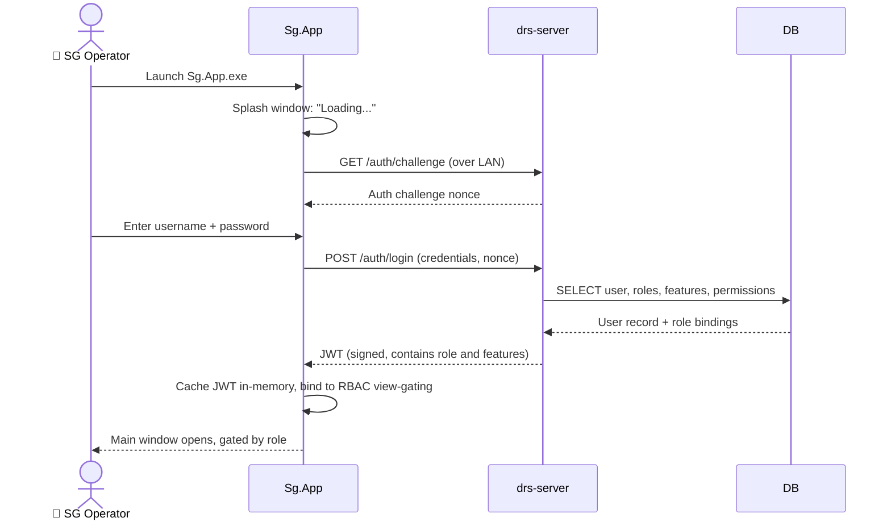
```mermaid
sequenceDiagram
    actor Op as 👤 SG Operator
    participant Sg.App
    participant drs-server
    participant DB

    Op->>Sg.App: Launch Sg.App.exe
    Sg.App->>Sg.App: Splash window: "Loading..."
    Sg.App->>drs-server: GET /auth/challenge (over LAN)
    drs-server-->>Sg.App: Auth challenge nonce
    Op->>Sg.App: Enter username + password
    Sg.App->>drs-server: POST /auth/login (credentials, nonce)
    drs-server->>DB: SELECT user, roles, features, permissions
    DB-->>drs-server: User record + role bindings
    drs-server-->>Sg.App: JWT (signed, contains role and features)
    Sg.App->>Sg.App: Cache JWT in-memory, bind to RBAC view-gating
    Sg.App-->>Op: Main window opens, gated by role
```

**Notes:**
- RBAC view-gating ensures the SG Operator sees only features their role allows (e.g. Admin sees DB Management; standard operator does not).
- JWT is short-lived; refresh on a separate endpoint not shown here.
- Failure modes (wrong credentials, drs-server unreachable, DB unreachable) all surface as actionable error dialogs in `Sg.App`.

### 1.2 DRS Engineer login (DRS webapp)

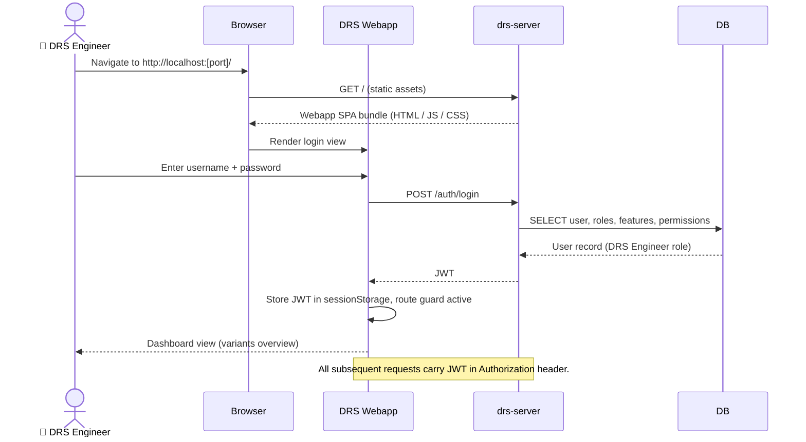
```mermaid
sequenceDiagram
    actor DRS as 👤 DRS Engineer
    participant Browser
    participant Webapp as DRS Webapp
    participant drs-server
    participant DB

    DRS->>Browser: Navigate to http://localhost:[port]/
    Browser->>drs-server: GET / (static assets)
    drs-server-->>Browser: Webapp SPA bundle (HTML / JS / CSS)
    Browser->>Webapp: Render login view
    DRS->>Webapp: Enter username + password
    Webapp->>drs-server: POST /auth/login
    drs-server->>DB: SELECT user, roles, features, permissions
    DB-->>drs-server: User record (DRS Engineer role)
    drs-server-->>Webapp: JWT
    Webapp->>Webapp: Store JWT in sessionStorage, route guard active
    Webapp-->>DRS: Dashboard view (variants overview)

    Note over Webapp,drs-server: All subsequent requests carry JWT in Authorization header.
```

**Notes:**
- The same `drs-server` `/auth/*` endpoints serve both SG Operator (via REST from `Sg.App`) and DRS Engineer (via REST from the webapp).
- DRS Engineer role permissions are distinct from SG Operator (RBAC catalogue is a Milestone-1 design item — [B1.16](design-backlog.md)).

---

## 2. Scenario authoring (SG Operator)

### 2.1 Create a new scenario

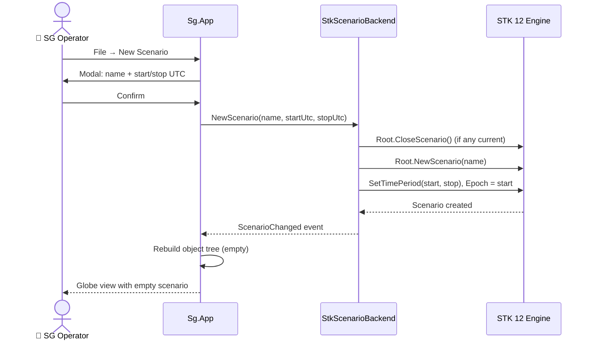
```mermaid
sequenceDiagram
    actor Op as 👤 SG Operator
    participant Sg.App
    participant Backend as StkScenarioBackend
    participant STK as STK 12 Engine

    Op->>Sg.App: File → New Scenario
    Sg.App->>Op: Modal: name + start/stop UTC
    Op->>Sg.App: Confirm
    Sg.App->>Backend: NewScenario(name, startUtc, stopUtc)
    Backend->>STK: Root.CloseScenario() (if any current)
    Backend->>STK: Root.NewScenario(name)
    Backend->>STK: SetTimePeriod(start, stop), Epoch = start
    STK-->>Backend: Scenario created
    Backend-->>Sg.App: ScenarioChanged event
    Sg.App->>Sg.App: Rebuild object tree (empty)
    Sg.App-->>Op: Globe view with empty scenario
```

### 2.2 Place an emitter on the map (click-to-place)

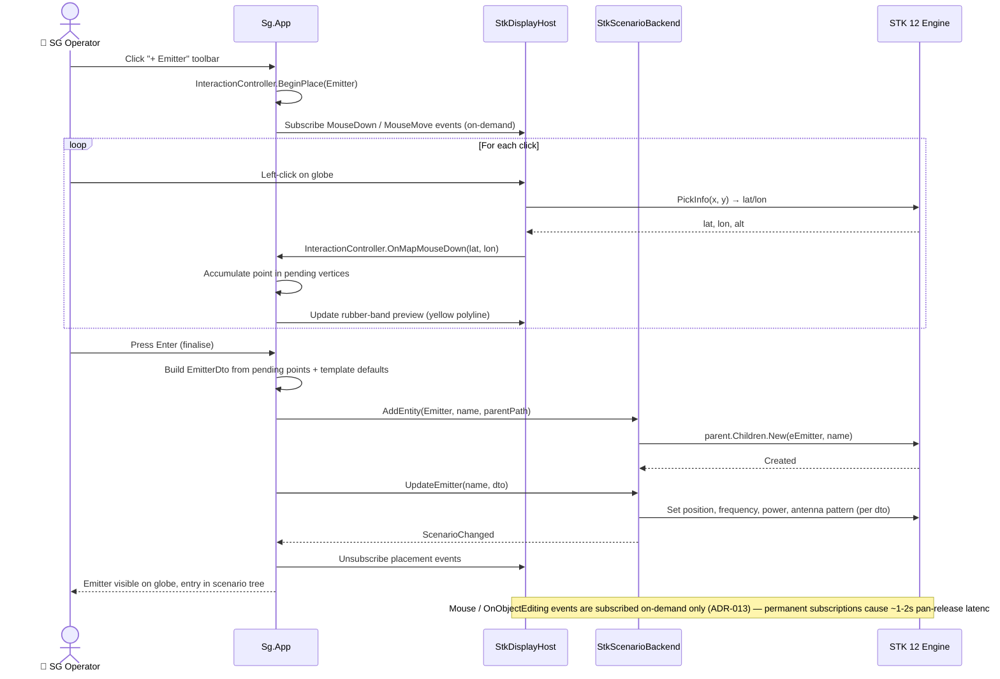
```mermaid
sequenceDiagram
    actor Op as 👤 SG Operator
    participant Sg.App
    participant Host as StkDisplayHost
    participant Backend as StkScenarioBackend
    participant STK as STK 12 Engine

    Op->>Sg.App: Click "+ Emitter" toolbar
    Sg.App->>Sg.App: InteractionController.BeginPlace(Emitter)
    Sg.App->>Host: Subscribe MouseDown / MouseMove events (on-demand)
    loop For each click
        Op->>Host: Left-click on globe
        Host->>STK: PickInfo(x, y) → lat/lon
        STK-->>Host: lat, lon, alt
        Host->>Sg.App: InteractionController.OnMapMouseDown(lat, lon)
        Sg.App->>Sg.App: Accumulate point in pending vertices
        Sg.App->>Host: Update rubber-band preview (yellow polyline)
    end
    Op->>Sg.App: Press Enter (finalise)
    Sg.App->>Sg.App: Build EmitterDto from pending points + template defaults
    Sg.App->>Backend: AddEntity(Emitter, name, parentPath)
    Backend->>STK: parent.Children.New(eEmitter, name)
    STK-->>Backend: Created
    Sg.App->>Backend: UpdateEmitter(name, dto)
    Backend->>STK: Set position, frequency, power, antenna pattern (per dto)
    Backend-->>Sg.App: ScenarioChanged
    Sg.App->>Host: Unsubscribe placement events
    Sg.App-->>Op: Emitter visible on globe, entry in scenario tree

    Note over Host,STK: Mouse / OnObjectEditing events are subscribed on-demand only (ADR-013) — permanent subscriptions cause ~1-2s pan-release latency.
```

### 2.3 Drag-edit an entity on the globe

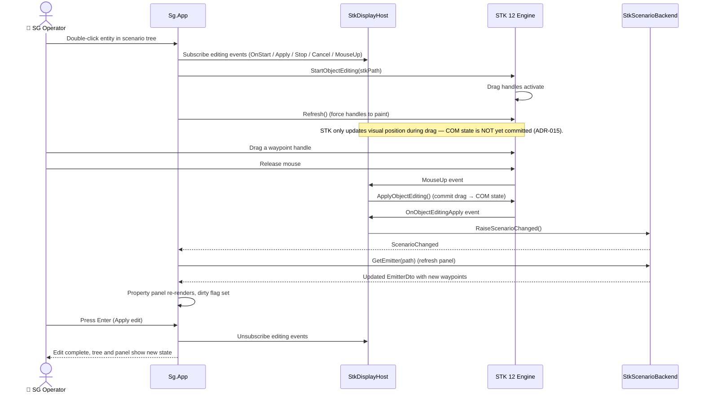
```mermaid
sequenceDiagram
    actor Op as 👤 SG Operator
    participant Sg.App
    participant Host as StkDisplayHost
    participant STK as STK 12 Engine
    participant Backend as StkScenarioBackend

    Op->>Sg.App: Double-click entity in scenario tree
    Sg.App->>Host: Subscribe editing events (OnStart / Apply / Stop / Cancel / MouseUp)
    Sg.App->>STK: StartObjectEditing(stkPath)
    STK->>STK: Drag handles activate
    Sg.App->>STK: Refresh() (force handles to paint)
    Note over STK,Host: STK only updates visual position during drag — COM state is NOT yet committed (ADR-015).
    Op->>STK: Drag a waypoint handle
    Op->>STK: Release mouse
    STK->>Host: MouseUp event
    Host->>STK: ApplyObjectEditing() (commit drag → COM state)
    STK->>Host: OnObjectEditingApply event
    Host->>Backend: RaiseScenarioChanged()
    Backend-->>Sg.App: ScenarioChanged
    Sg.App->>Backend: GetEmitter(path) (refresh panel)
    Backend-->>Sg.App: Updated EmitterDto with new waypoints
    Sg.App->>Sg.App: Property panel re-renders, dirty flag set
    Op->>Sg.App: Press Enter (Apply edit)
    Sg.App->>Host: Unsubscribe editing events
    Sg.App-->>Op: Edit complete, tree and panel show new state
```

### 2.4 Save scenario (to library)

Per [Scenario Management design §4.3](specs/scenario-management-design.md#43-save-flow): the database is the source of truth. STK holds the live DTO graph in COM; saving serialises the graph to `content_json` and writes it to the `scenarios` table on WS2 PostgreSQL. The hash diff on `content_json.compute_inputs` decides whether `computed_links` for this scenario gets DELETEd. Operator-triggered `.sc`/`.vdf` export is a separate flow in §2.10.

```mermaid
sequenceDiagram
    actor Op as 👤 SG Operator
    participant Sg.App
    participant Backend as StkScenarioBackend
    participant STK as STK 12 Engine
    participant DB as scenarios (PostgreSQL on WS2)

    Op->>Sg.App: File → Save
    Sg.App->>Backend: Serialise current DTO graph
    Backend->>STK: Walk scenario → emit DTOs<br/>(entities, emitters, antennas, env, time)
    STK-->>Backend: Live DTO graph
    Backend-->>Sg.App: content_json = { compute_inputs, metadata }
    Sg.App->>Sg.App: hash_new = sha256(content_json.compute_inputs)

    Sg.App->>DB: BEGIN TRANSACTION
    Sg.App->>DB: SELECT compute_inputs_hash, compute_state<br/>FROM scenarios WHERE scenario_id=X FOR UPDATE
    DB-->>Sg.App: hash_old, state_old

    alt hash_new != hash_old (compute-inputs changed)
        Sg.App->>DB: DELETE FROM computed_links WHERE scenario_id=X
        Sg.App->>DB: UPDATE scenarios SET<br/>content_json=..., compute_inputs_hash=hash_new,<br/>compute_state='STALE', updated_at=now(), updated_by=Op
        Note over Sg.App,DB: Edit invalidates prior compute. Library badge flips to STALE.
    else hash unchanged (metadata-only edit, or no-op)
        Sg.App->>DB: UPDATE scenarios SET<br/>content_json=..., updated_at=now(), updated_by=Op
        Note over Sg.App,DB: Name / tags / notes only. compute_state untouched; computed_links untouched.
    end
    Sg.App->>DB: COMMIT
    Sg.App-->>Op: Toast "Scenario saved"
```

**Notes:**
- The cross-LAN PostgreSQL round-trip is acceptable here — save is operator-triggered, not on the hot path.
- Concurrent edit during execution is blocked at the UI level: if `scenario_id` is the currently-executing exercise (per Sg.App's `IExerciseStateService`), the Save button is disabled. Operator must Stop the exercise first.
- The `compute_inputs` vs `metadata` partition lives inside `content_json` per spec §4.1.

### 2.5 EW Library — emitter template CRUD

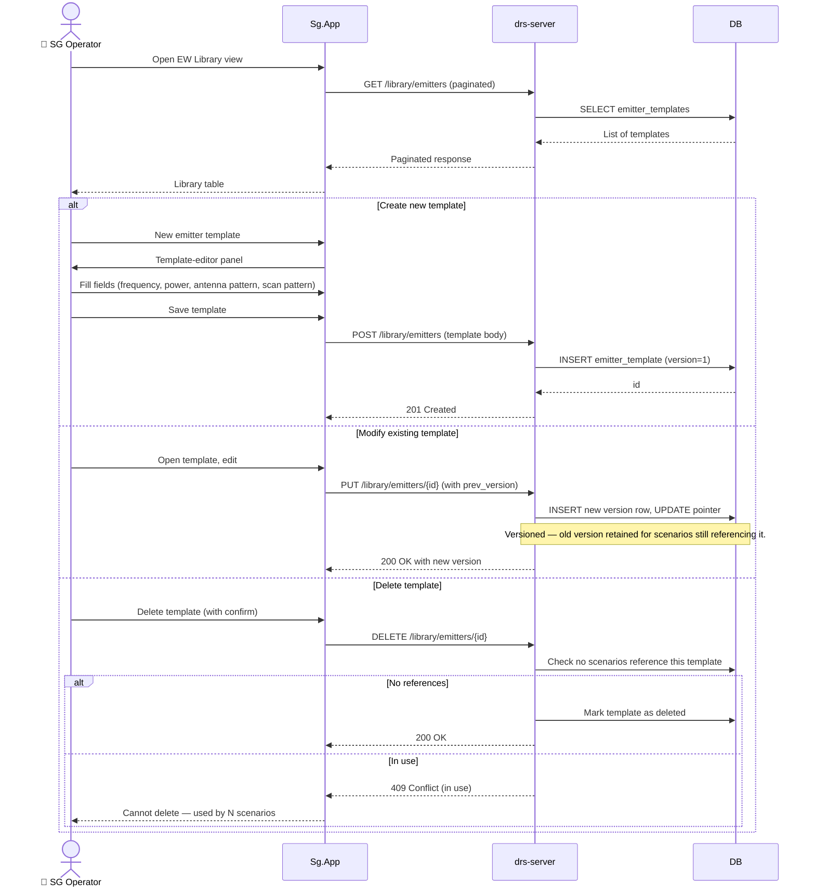
```mermaid
sequenceDiagram
    actor Op as 👤 SG Operator
    participant Sg.App
    participant drs-server
    participant DB

    Op->>Sg.App: Open EW Library view
    Sg.App->>drs-server: GET /library/emitters (paginated)
    drs-server->>DB: SELECT emitter_templates
    DB-->>drs-server: List of templates
    drs-server-->>Sg.App: Paginated response
    Sg.App-->>Op: Library table

    alt Create new template
        Op->>Sg.App: New emitter template
        Sg.App->>Op: Template-editor panel
        Op->>Sg.App: Fill fields (frequency, power, antenna pattern, scan pattern)
        Op->>Sg.App: Save template
        Sg.App->>drs-server: POST /library/emitters (template body)
        drs-server->>DB: INSERT emitter_template (version=1)
        DB-->>drs-server: id
        drs-server-->>Sg.App: 201 Created
    else Modify existing template
        Op->>Sg.App: Open template, edit
        Sg.App->>drs-server: PUT /library/emitters/{id} (with prev_version)
        drs-server->>DB: INSERT new version row, UPDATE pointer
        Note over drs-server,DB: Versioned — old version retained for scenarios still referencing it.
        drs-server-->>Sg.App: 200 OK with new version
    else Delete template
        Op->>Sg.App: Delete template (with confirm)
        Sg.App->>drs-server: DELETE /library/emitters/{id}
        drs-server->>DB: Check no scenarios reference this template
        alt No references
            drs-server->>DB: Mark template as deleted
            drs-server-->>Sg.App: 200 OK
        else In use
            drs-server-->>Sg.App: 409 Conflict (in use)
            Sg.App-->>Op: Cannot delete — used by N scenarios
        end
    end
```

**Notes:**
- Apriori Known Own/Enemy info base has the same shape; separate `/library/apriori` endpoints.

### 2.6 Compute link analysis (Scenario modes)

Per [Scenario Management design §4.4](specs/scenario-management-design.md#44-compute--recompute-flow): compute is split into **three** transactions so the cross-LAN write lock is never held during the multi-minute STK compute loop. T1 records the about-to-be-computed scenario state immutably in `scenario_compute_snapshots`; each batched `computed_links` INSERT is its own short transaction inside the compute loop; T3 flips the scenario state to COMPUTED at the end.

```mermaid
sequenceDiagram
    actor Op as 👤 SG Operator
    participant Sg.App
    participant Backend as StkScenarioBackend
    participant STK as STK 12 Engine
    participant DB as TimescaleDB (WS2)

    Op->>Sg.App: Compute → Compute Links

    rect rgba(200,255,200,0.3)
        Note over Sg.App,DB: T1 — pre-compute snapshot (fast, single transaction)
        Sg.App->>DB: BEGIN
        Sg.App->>DB: INSERT INTO scenario_compute_snapshots<br/>(snapshot_id=uuidgen(), scenario_id=X, computed_at=now(),<br/>computed_by=Op, content_json=current, compute_inputs_hash=current)
        Sg.App->>DB: COMMIT
    end

    Sg.App->>Backend: ComputeLinks(scenario_id, snapshot_id)
    Backend->>STK: Root.BeginUpdate()
    Backend->>STK: Walk scenario, build (entity, emitter) pairs
    loop For each tick T in [start, stop] step 1s
        Backend->>STK: Update positions for T
        Backend->>STK: Compute access + AER + path loss + signal strength
        STK-->>Backend: (range, az, el, doppler, signal_strength, …) per pair
        Backend->>Backend: Buffer batch (100 ticks)
        alt Buffer full
            Backend->>DB: BEGIN; INSERT INTO computed_links<br/>(tagged with scenario_id); COMMIT
        end
        Sg.App->>Op: Progress T / total_ticks
    end
    Backend->>STK: Root.EndUpdate()
    Backend->>DB: BEGIN; flush final batch into computed_links; COMMIT

    rect rgba(200,255,200,0.3)
        Note over Sg.App,DB: T3 — post-compute state flip (fast, single transaction)
        Sg.App->>DB: BEGIN
        Sg.App->>DB: UPDATE scenarios SET compute_state='COMPUTED',<br/>last_computed_at=now(), last_computed_snapshot=<snapshot_id><br/>WHERE scenario_id=X
        Sg.App->>DB: COMMIT
    end
    Sg.App-->>Op: "Compute complete — exercise ready to execute"
```

**Failure recovery** (per spec §4.4):

| Failure point | State after failure | Recovery |
|---|---|---|
| T1 (snapshot INSERT) | scenario unchanged | Operator re-clicks Compute |
| STK loop / batched INSERT | scenario unchanged; orphaned snapshot + partial `computed_links` rows | Operator re-clicks Compute. Save flow's hash-diff DELETEs partial rows; fresh snapshot inserted; T3 advances `last_computed_snapshot` to the new one. Orphan snapshot remains in history (harmless). |
| T3 (state flip) | snapshot exists; `computed_links` rows complete; `scenarios.compute_state` not flipped | Idempotent: operator re-clicks Compute, hash-diff DELETEs and reinserts, T3 reruns. |

The deliberate non-atomicity between T1 and T3 is the trade for **not** holding a multi-minute write lock that would block other PostgreSQL readers (e.g., Sg.App library list polling, drs-server queries).

**Notes:**
- `computed_links` is the source of truth for Scenario-mode exercise execution (§3.2).
- The hot-path scenario publisher query stays simple — no `snapshot_id` filter — because REPLACE semantics ensure only one generation of rows exists at a time.

### 2.7 Open scenario from library

Per [Scenario Management design §4.7](specs/scenario-management-design.md#47-library-ui-in-sgapp): the operator opens a scenario by selecting it from the library list. Sg.App fetches the JSON, deserialises into the DTO graph, and pushes the DTOs into STK via `IScenarioBackend.LoadFromJson(content_json)`. STK never touches the filesystem on this path.

```mermaid
sequenceDiagram
    actor Op as 👤 SG Operator
    participant Sg.App
    participant Backend as StkScenarioBackend
    participant STK as STK 12 Engine
    participant DB as scenarios (PostgreSQL on WS2)

    Op->>Sg.App: Open Library view
    Sg.App->>DB: SELECT scenario_id, name, owner, compute_state,<br/>last_computed_at, updated_at FROM scenarios<br/>WHERE archived_at IS NULL ORDER BY updated_at DESC
    DB-->>Sg.App: Library list
    Sg.App-->>Op: Library table (state badges: green=COMPUTED, amber=STALE, grey=NOT_COMPUTED)

    Op->>Sg.App: Click row → Open
    Sg.App->>DB: SELECT content_json FROM scenarios WHERE scenario_id=X
    DB-->>Sg.App: content_json
    Sg.App->>Backend: LoadFromJson(content_json)
    Backend->>STK: Root.CloseScenario() (if any current)
    Backend->>STK: Root.NewScenario(content_json.metadata.name)
    Backend->>STK: SetTimePeriod(content_json.compute_inputs.time_window)
    loop For each entity in content_json.compute_inputs.entities
        Backend->>STK: parent.Children.New(kind, name)
        Backend->>STK: Apply entity DTO (position, motion, sensors, …)
    end
    loop For each emitter in content_json.compute_inputs.emitters
        Backend->>STK: Inline EW Library template + instance overrides
        Backend->>STK: Apply emitter properties
    end
    Backend-->>Sg.App: ScenarioChanged event
    Sg.App->>Sg.App: Rebuild object tree from STK state
    Sg.App-->>Op: Globe view shows scenario; state badge reflects DB state
```

**Notes:**
- EW Library templates are **inlined** at this point: the scenario's `compute_inputs.emitters[].template_id` is dereferenced against the EW Library and the live template values are pushed into STK. The same inlining happens at compute time so the snapshot stored in `scenario_compute_snapshots` is self-contained (see spec §4.8).
- Loading is a programmatic push of DTOs, not a `.sc` file parse. Importing from a `.sc` file is a separate flow in §2.10.

### 2.8 Recompute = save + compute (no separate operation)

Per [Scenario Management design §4.5](specs/scenario-management-design.md#45-recompute--save--compute): there is no separate "Recompute" operation. To recompute a STALE scenario, the operator clicks Compute. If the operator edited compute-inputs since the last successful compute, the save flow (§2.4) has already DELETEd the prior `computed_links` rows and flipped state to STALE. Compute (§2.6) then writes a fresh snapshot + fresh `computed_links` rows + flips state to COMPUTED.

This keeps the hot-path scenario publisher query in §3.2 simple — it never needs to disambiguate between compute generations.

### 2.9 Library operations — archive, hard delete, filter

Per [Scenario Management design §4.7](specs/scenario-management-design.md#47-library-ui-in-sgapp):

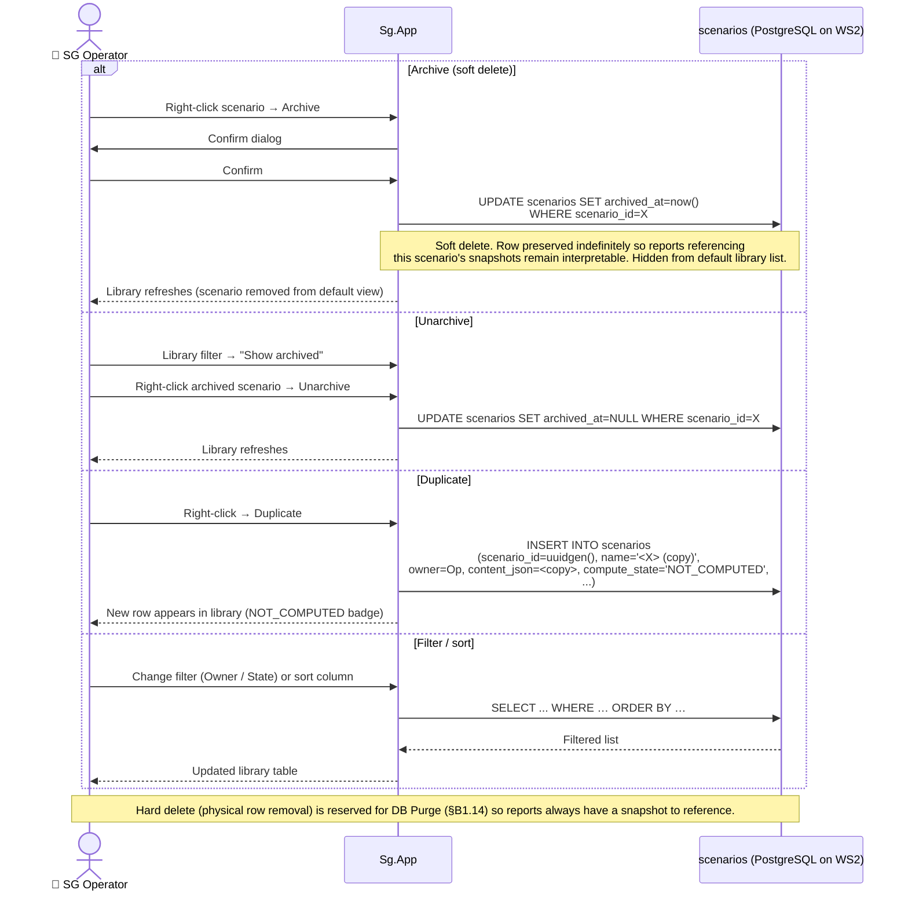
```mermaid
sequenceDiagram
    actor Op as 👤 SG Operator
    participant Sg.App
    participant DB as scenarios (PostgreSQL on WS2)

    alt Archive (soft delete)
        Op->>Sg.App: Right-click scenario → Archive
        Sg.App->>Op: Confirm dialog
        Op->>Sg.App: Confirm
        Sg.App->>DB: UPDATE scenarios SET archived_at=now()<br/>WHERE scenario_id=X
        Note over Sg.App,DB: Soft delete. Row preserved indefinitely so reports referencing<br/>this scenario's snapshots remain interpretable. Hidden from default library list.
        Sg.App-->>Op: Library refreshes (scenario removed from default view)
    else Unarchive
        Op->>Sg.App: Library filter → "Show archived"
        Op->>Sg.App: Right-click archived scenario → Unarchive
        Sg.App->>DB: UPDATE scenarios SET archived_at=NULL WHERE scenario_id=X
        Sg.App-->>Op: Library refreshes
    else Duplicate
        Op->>Sg.App: Right-click → Duplicate
        Sg.App->>DB: INSERT INTO scenarios<br/>(scenario_id=uuidgen(), name='<X> (copy)',<br/>owner=Op, content_json=<copy>, compute_state='NOT_COMPUTED',<br/>...)
        Sg.App-->>Op: New row appears in library (NOT_COMPUTED badge)
    else Filter / sort
        Op->>Sg.App: Change filter (Owner / State) or sort column
        Sg.App->>DB: SELECT ... WHERE … ORDER BY …
        DB-->>Sg.App: Filtered list
        Sg.App-->>Op: Updated library table
    end

    Note over Op,DB: Hard delete (physical row removal) is reserved for DB Purge (§B1.14) so reports always have a snapshot to reference.
```

### 2.10 Export `.sc` / `.vdf` and Import `.sc` / `.vdf`

Operator-triggered, separate from the routine save flow. The `.sc`/`.vdf` file is an interoperability artifact for STK Desktop / Insight inspection or for backup snapshots; EWTSS v2 does not retain it on disk between exports.

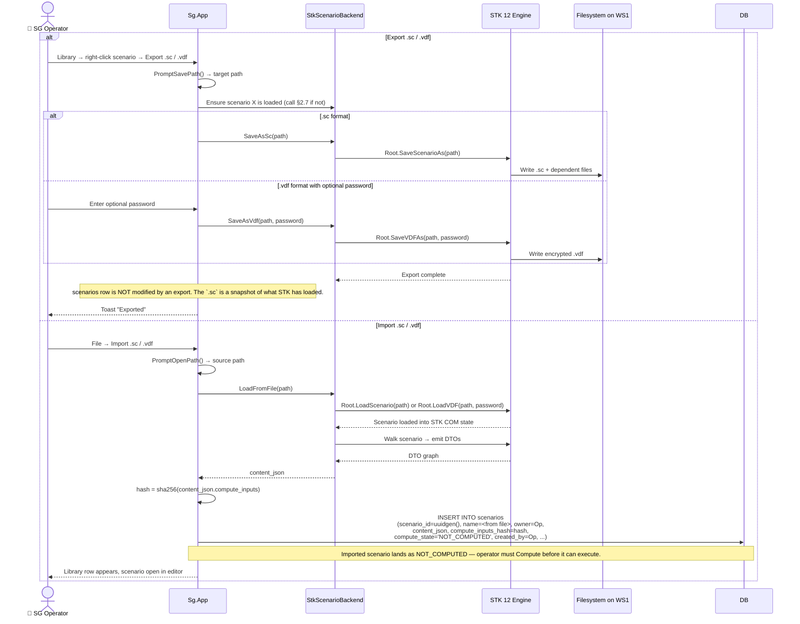
```mermaid
sequenceDiagram
    actor Op as 👤 SG Operator
    participant Sg.App
    participant Backend as StkScenarioBackend
    participant STK as STK 12 Engine
    participant FS as Filesystem on WS1

    alt Export .sc / .vdf
        Op->>Sg.App: Library → right-click scenario → Export .sc / .vdf
        Sg.App->>Sg.App: PromptSavePath() → target path
        Sg.App->>Backend: Ensure scenario X is loaded (call §2.7 if not)
        alt .sc format
            Sg.App->>Backend: SaveAsSc(path)
            Backend->>STK: Root.SaveScenarioAs(path)
            STK->>FS: Write .sc + dependent files
        else .vdf format with optional password
            Op->>Sg.App: Enter optional password
            Sg.App->>Backend: SaveAsVdf(path, password)
            Backend->>STK: Root.SaveVDFAs(path, password)
            STK->>FS: Write encrypted .vdf
        end
        STK-->>Backend: Export complete
        Note over Sg.App: scenarios row is NOT modified by an export. The `.sc` is a snapshot of what STK has loaded.
        Sg.App-->>Op: Toast "Exported"
    else Import .sc / .vdf
        Op->>Sg.App: File → Import .sc / .vdf
        Sg.App->>Sg.App: PromptOpenPath() → source path
        Sg.App->>Backend: LoadFromFile(path)
        Backend->>STK: Root.LoadScenario(path) or Root.LoadVDF(path, password)
        STK-->>Backend: Scenario loaded into STK COM state
        Backend->>STK: Walk scenario → emit DTOs
        STK-->>Backend: DTO graph
        Backend-->>Sg.App: content_json
        Sg.App->>Sg.App: hash = sha256(content_json.compute_inputs)
        Sg.App->>DB: INSERT INTO scenarios<br/>(scenario_id=uuidgen(), name=<from file>, owner=Op,<br/>content_json, compute_inputs_hash=hash,<br/>compute_state='NOT_COMPUTED', created_by=Op, ...)
        Note over Sg.App,DB: Imported scenario lands as NOT_COMPUTED — operator must Compute before it can execute.
        Sg.App-->>Op: Library row appears, scenario open in editor
    end
```

**Notes:**
- Export does not modify the `scenarios` row — it's purely a read-out of the current STK state.
- Import always creates a new `scenario_id`. Importing a `.sc` that originated from the same library does not merge with the existing row; it creates a separate library entry.
- `.sc`/`.vdf` files are not retained on disk by EWTSS v2 between exports — single-site delivery makes cross-deployment portability out of scope.

---

## 3. Exercise execution

### 3.1 Standalone + Random mode execution

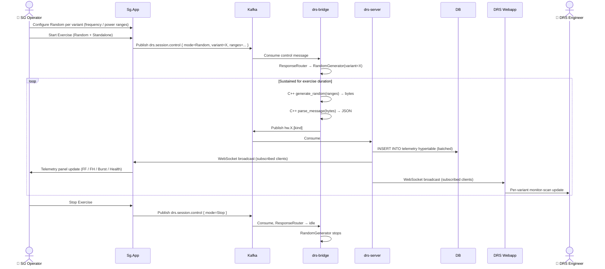
```mermaid
sequenceDiagram
    actor Op as 👤 SG Operator
    participant Sg.App
    participant Kafka
    participant drs-bridge
    participant drs-server
    participant DB
    participant Webapp as DRS Webapp
    actor DRS as 👤 DRS Engineer

    Op->>Sg.App: Configure Random per variant (frequency / power ranges)
    Op->>Sg.App: Start Exercise (Random + Standalone)
    Sg.App->>Kafka: Publish drs.session.control { mode=Random, variant=X, ranges=... }
    Kafka->>drs-bridge: Consume control message
    drs-bridge->>drs-bridge: ResponseRouter → RandomGenerator(variant=X)
    loop Sustained for exercise duration
        drs-bridge->>drs-bridge: C++ generate_random(ranges) → bytes
        drs-bridge->>drs-bridge: C++ parse_message(bytes) → JSON
        drs-bridge->>Kafka: Publish hw.X.[kind]
        Kafka->>drs-server: Consume
        drs-server->>DB: INSERT INTO telemetry hypertable (batched)
        drs-server->>Sg.App: WebSocket broadcast (subscribed clients)
        Sg.App->>Op: Telemetry panel update (FF / FH / Burst / Health)
        drs-server->>Webapp: WebSocket broadcast (subscribed clients)
        Webapp->>DRS: Per-variant monitor-scan update
    end
    Op->>Sg.App: Stop Exercise
    Sg.App->>Kafka: Publish drs.session.control { mode=Stop }
    Kafka->>drs-bridge: Consume, ResponseRouter → idle
    drs-bridge->>drs-bridge: RandomGenerator stops
```

**Notes:**
- No STK involvement at runtime — Random mode is per-variant synthetic data.
- DRS webapp receives the same telemetry stream the SG-side panels do, via independent WebSocket subscriptions.

### 3.2 Standalone + Scenario mode execution

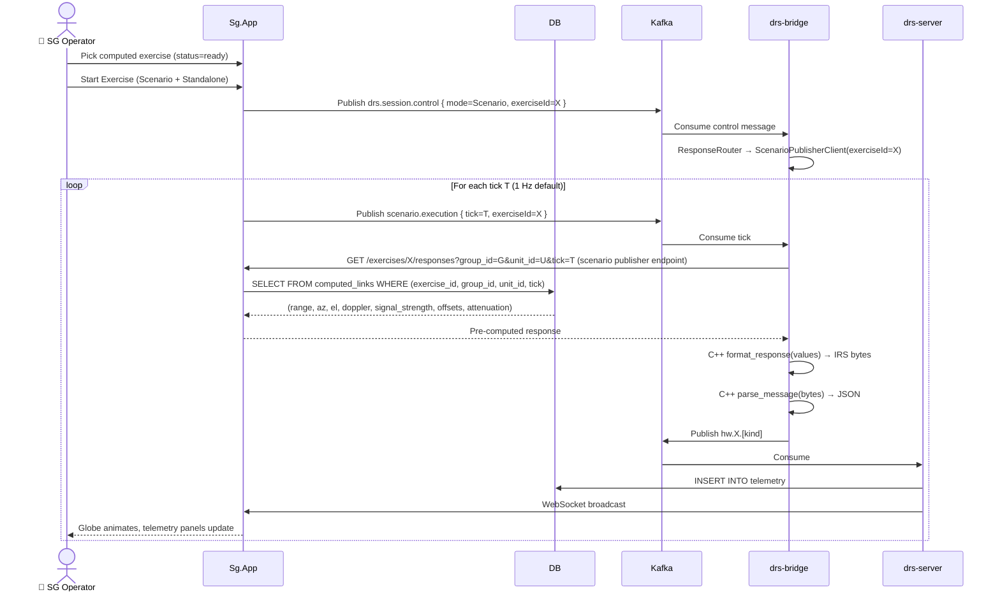
```mermaid
sequenceDiagram
    actor Op as 👤 SG Operator
    participant Sg.App
    participant DB
    participant Kafka
    participant drs-bridge
    participant drs-server

    Op->>Sg.App: Pick computed exercise (status=ready)
    Op->>Sg.App: Start Exercise (Scenario + Standalone)
    Sg.App->>Kafka: Publish drs.session.control { mode=Scenario, exerciseId=X }
    Kafka->>drs-bridge: Consume control message
    drs-bridge->>drs-bridge: ResponseRouter → ScenarioPublisherClient(exerciseId=X)
    loop For each tick T (1 Hz default)
        Sg.App->>Kafka: Publish scenario.execution { tick=T, exerciseId=X }
        Kafka->>drs-bridge: Consume tick
        drs-bridge->>Sg.App: GET /exercises/X/responses?group_id=G&unit_id=U&tick=T (scenario publisher endpoint)
        Sg.App->>DB: SELECT FROM computed_links WHERE (exercise_id, group_id, unit_id, tick)
        DB-->>Sg.App: (range, az, el, doppler, signal_strength, offsets, attenuation)
        Sg.App-->>drs-bridge: Pre-computed response
        drs-bridge->>drs-bridge: C++ format_response(values) → IRS bytes
        drs-bridge->>drs-bridge: C++ parse_message(bytes) → JSON
        drs-bridge->>Kafka: Publish hw.X.[kind]
        Kafka->>drs-server: Consume
        drs-server->>DB: INSERT INTO telemetry
        drs-server->>Sg.App: WebSocket broadcast
        Sg.App-->>Op: Globe animates, telemetry panels update
    end
```

**Notes:**
- The scenario publisher endpoint on `Sg.App` is hot-path (called once per tick × per (group, unit) tuple). Phase 4 / Phase 5 integration tests measure its latency (target p99 ≤ 30 ms).
- If p99 exceeds budget under load, the in-memory `computed_links` cache mitigation (Execution Plan §3.3) is engaged.

### 3.3 Integrated + Scenario mode execution

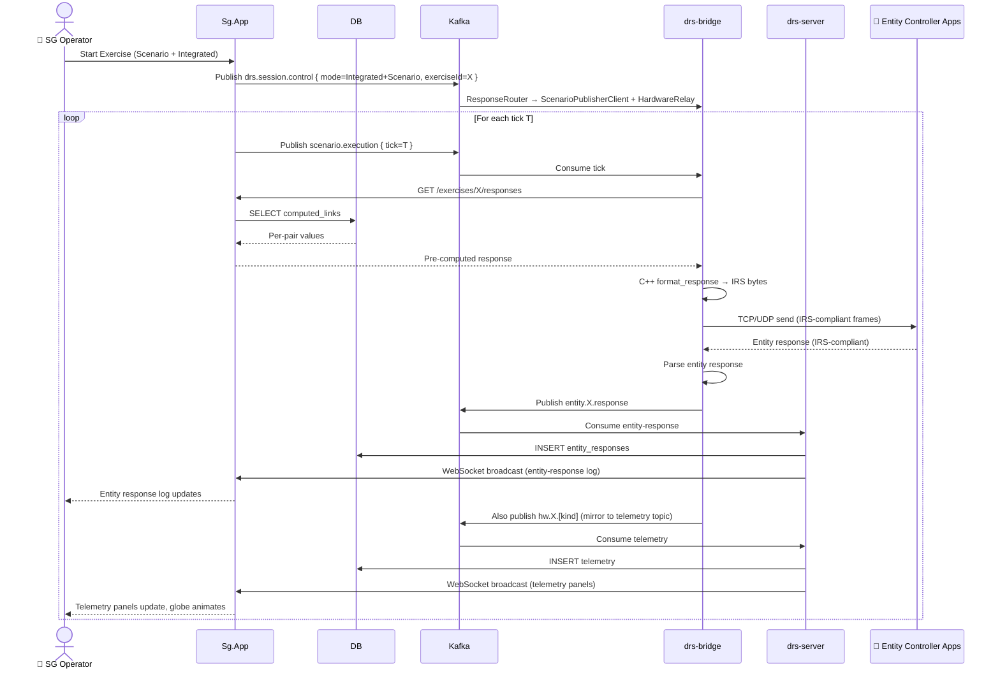
```mermaid
sequenceDiagram
    actor Op as 👤 SG Operator
    participant Sg.App
    participant DB
    participant Kafka
    participant drs-bridge
    participant drs-server
    participant EC as 🔌 Entity Controller Apps

    Op->>Sg.App: Start Exercise (Scenario + Integrated)
    Sg.App->>Kafka: Publish drs.session.control { mode=Integrated+Scenario, exerciseId=X }
    Kafka->>drs-bridge: ResponseRouter → ScenarioPublisherClient + HardwareRelay
    loop For each tick T
        Sg.App->>Kafka: Publish scenario.execution { tick=T }
        Kafka->>drs-bridge: Consume tick
        drs-bridge->>Sg.App: GET /exercises/X/responses
        Sg.App->>DB: SELECT computed_links
        DB-->>Sg.App: Per-pair values
        Sg.App-->>drs-bridge: Pre-computed response
        drs-bridge->>drs-bridge: C++ format_response → IRS bytes
        drs-bridge->>EC: TCP/UDP send (IRS-compliant frames)
        EC-->>drs-bridge: Entity response (IRS-compliant)
        drs-bridge->>drs-bridge: Parse entity response
        drs-bridge->>Kafka: Publish entity.X.response
        Kafka->>drs-server: Consume entity-response
        drs-server->>DB: INSERT entity_responses
        drs-server->>Sg.App: WebSocket broadcast (entity-response log)
        Sg.App-->>Op: Entity response log updates
        drs-bridge->>Kafka: Also publish hw.X.[kind] (mirror to telemetry topic)
        Kafka->>drs-server: Consume telemetry
        drs-server->>DB: INSERT telemetry
        drs-server->>Sg.App: WebSocket broadcast (telemetry panels)
        Sg.App-->>Op: Telemetry panels update, globe animates
    end
```

**Notes:**
- The Entity Controller is client-owned (🔌); v2 sends to it per the IRS for that variant.
- Same tick produces both telemetry (hw.X.\<kind\>) and entity-response (entity.X.response) traffic.
- Path 3 cross-LAN latency (Sg.App scenario publisher endpoint) is measured under Integrated load at Phase 5 (week 13 gate).

### 3.4 Playback control — pause / resume / stop

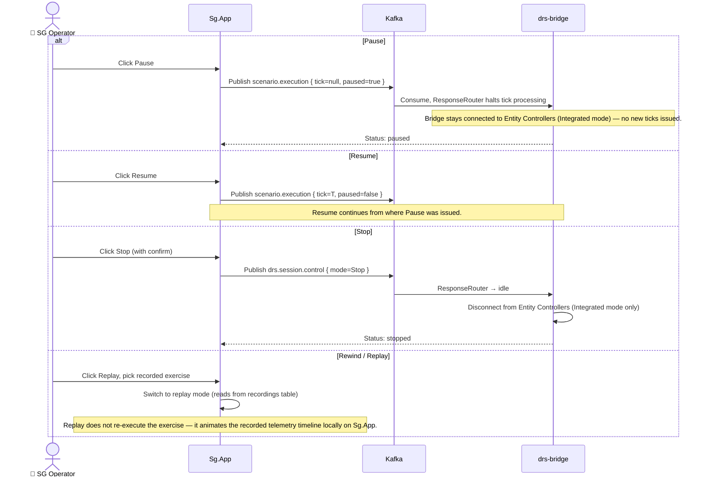
```mermaid
sequenceDiagram
    actor Op as 👤 SG Operator
    participant Sg.App
    participant Kafka
    participant drs-bridge

    alt Pause
        Op->>Sg.App: Click Pause
        Sg.App->>Kafka: Publish scenario.execution { tick=null, paused=true }
        Kafka->>drs-bridge: Consume, ResponseRouter halts tick processing
        Note over drs-bridge: Bridge stays connected to Entity Controllers (Integrated mode) — no new ticks issued.
        drs-bridge-->>Sg.App: Status: paused
    else Resume
        Op->>Sg.App: Click Resume
        Sg.App->>Kafka: Publish scenario.execution { tick=T, paused=false }
        Note over Sg.App,drs-bridge: Resume continues from where Pause was issued.
    else Stop
        Op->>Sg.App: Click Stop (with confirm)
        Sg.App->>Kafka: Publish drs.session.control { mode=Stop }
        Kafka->>drs-bridge: ResponseRouter → idle
        drs-bridge->>drs-bridge: Disconnect from Entity Controllers (Integrated mode only)
        drs-bridge-->>Sg.App: Status: stopped
    else Rewind / Replay
        Op->>Sg.App: Click Replay, pick recorded exercise
        Sg.App->>Sg.App: Switch to replay mode (reads from recordings table)
        Note over Sg.App: Replay does not re-execute the exercise — it animates the recorded telemetry timeline locally on Sg.App.
    end
```

---

## 4. DRS Engineer flows (DRS webapp on WS2)

### 4.1 View dashboard + variant selection

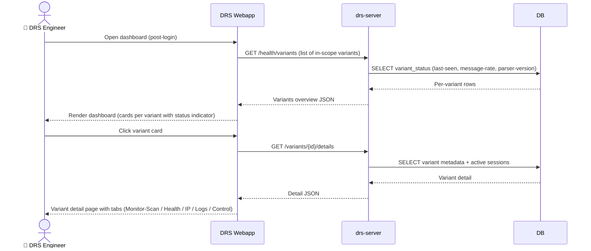
```mermaid
sequenceDiagram
    actor DRS as 👤 DRS Engineer
    participant Webapp as DRS Webapp
    participant drs-server
    participant DB

    DRS->>Webapp: Open dashboard (post-login)
    Webapp->>drs-server: GET /health/variants (list of in-scope variants)
    drs-server->>DB: SELECT variant_status (last-seen, message-rate, parser-version)
    DB-->>drs-server: Per-variant rows
    drs-server-->>Webapp: Variants overview JSON
    Webapp-->>DRS: Render dashboard (cards per variant with status indicator)

    DRS->>Webapp: Click variant card
    Webapp->>drs-server: GET /variants/{id}/details
    drs-server->>DB: SELECT variant metadata + active sessions
    DB-->>drs-server: Variant detail
    drs-server-->>Webapp: Detail JSON
    Webapp-->>DRS: Variant detail page with tabs (Monitor-Scan / Health / IP / Logs / Control)
```

### 4.2 Per-variant monitor-scan (live)

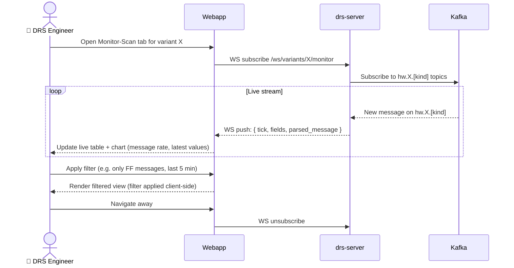
```mermaid
sequenceDiagram
    actor DRS as 👤 DRS Engineer
    participant Webapp
    participant drs-server
    participant Kafka

    DRS->>Webapp: Open Monitor-Scan tab for variant X
    Webapp->>drs-server: WS subscribe /ws/variants/X/monitor
    drs-server->>Kafka: Subscribe to hw.X.[kind] topics
    loop Live stream
        Kafka-->>drs-server: New message on hw.X.[kind]
        drs-server-->>Webapp: WS push: { tick, fields, parsed_message }
        Webapp-->>DRS: Update live table + chart (message rate, latest values)
    end
    DRS->>Webapp: Apply filter (e.g. only FF messages, last 5 min)
    Webapp-->>DRS: Render filtered view (filter applied client-side)
    DRS->>Webapp: Navigate away
    Webapp->>drs-server: WS unsubscribe
```

### 4.3 IP / network configuration for a variant

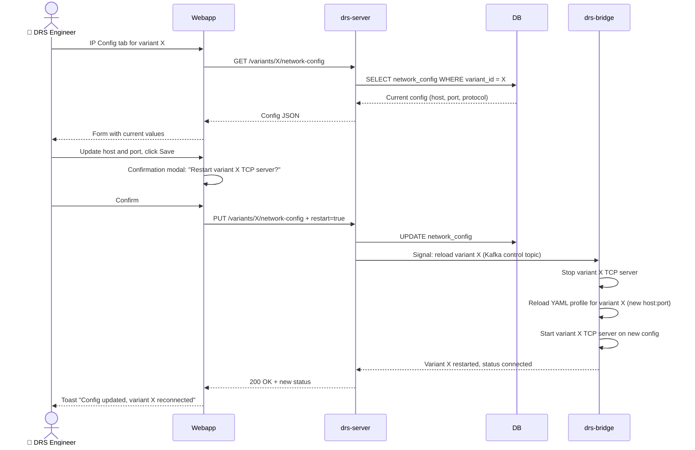
```mermaid
sequenceDiagram
    actor DRS as 👤 DRS Engineer
    participant Webapp
    participant drs-server
    participant DB
    participant drs-bridge

    DRS->>Webapp: IP Config tab for variant X
    Webapp->>drs-server: GET /variants/X/network-config
    drs-server->>DB: SELECT network_config WHERE variant_id = X
    DB-->>drs-server: Current config (host, port, protocol)
    drs-server-->>Webapp: Config JSON
    Webapp-->>DRS: Form with current values
    DRS->>Webapp: Update host and port, click Save
    Webapp->>Webapp: Confirmation modal: "Restart variant X TCP server?"
    DRS->>Webapp: Confirm
    Webapp->>drs-server: PUT /variants/X/network-config + restart=true
    drs-server->>DB: UPDATE network_config
    drs-server->>drs-bridge: Signal: reload variant X (Kafka control topic)
    drs-bridge->>drs-bridge: Stop variant X TCP server
    drs-bridge->>drs-bridge: Reload YAML profile for variant X (new host:port)
    drs-bridge->>drs-bridge: Start variant X TCP server on new config
    drs-bridge-->>drs-server: Variant X restarted, status connected
    drs-server-->>Webapp: 200 OK + new status
    Webapp-->>DRS: Toast "Config updated, variant X reconnected"
```

### 4.4 Message log review with filter / sort

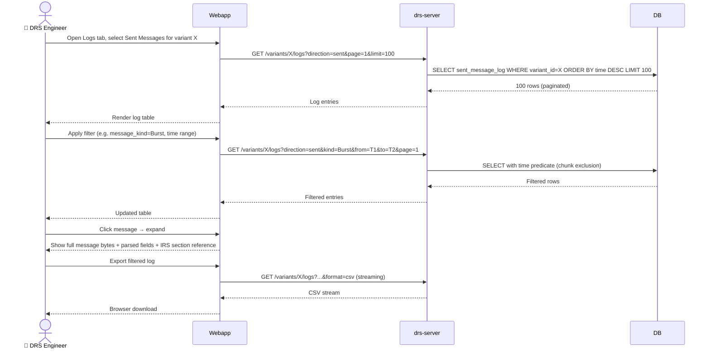
```mermaid
sequenceDiagram
    actor DRS as 👤 DRS Engineer
    participant Webapp
    participant drs-server
    participant DB

    DRS->>Webapp: Open Logs tab, select Sent Messages for variant X
    Webapp->>drs-server: GET /variants/X/logs?direction=sent&page=1&limit=100
    drs-server->>DB: SELECT sent_message_log WHERE variant_id=X ORDER BY time DESC LIMIT 100
    DB-->>drs-server: 100 rows (paginated)
    drs-server-->>Webapp: Log entries
    Webapp-->>DRS: Render log table

    DRS->>Webapp: Apply filter (e.g. message_kind=Burst, time range)
    Webapp->>drs-server: GET /variants/X/logs?direction=sent&kind=Burst&from=T1&to=T2&page=1
    drs-server->>DB: SELECT with time predicate (chunk exclusion)
    DB-->>drs-server: Filtered rows
    drs-server-->>Webapp: Filtered entries
    Webapp-->>DRS: Updated table

    DRS->>Webapp: Click message → expand
    Webapp-->>DRS: Show full message bytes + parsed fields + IRS section reference

    DRS->>Webapp: Export filtered log
    Webapp->>drs-server: GET /variants/X/logs?...&format=csv (streaming)
    drs-server-->>Webapp: CSV stream
    Webapp-->>DRS: Browser download
```

### 4.5 Restart per-variant parser / TCP server

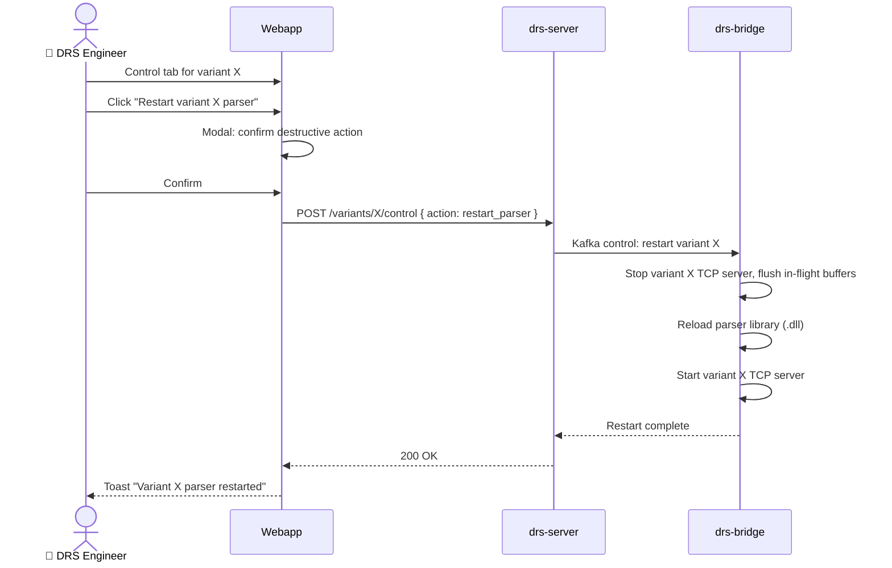
```mermaid
sequenceDiagram
    actor DRS as 👤 DRS Engineer
    participant Webapp
    participant drs-server
    participant drs-bridge

    DRS->>Webapp: Control tab for variant X
    DRS->>Webapp: Click "Restart variant X parser"
    Webapp->>Webapp: Modal: confirm destructive action
    DRS->>Webapp: Confirm
    Webapp->>drs-server: POST /variants/X/control { action: restart_parser }
    drs-server->>drs-bridge: Kafka control: restart variant X
    drs-bridge->>drs-bridge: Stop variant X TCP server, flush in-flight buffers
    drs-bridge->>drs-bridge: Reload parser library (.dll)
    drs-bridge->>drs-bridge: Start variant X TCP server
    drs-bridge-->>drs-server: Restart complete
    drs-server-->>Webapp: 200 OK
    Webapp-->>DRS: Toast "Variant X parser restarted"
```

---

## 5. Cross-persona / cross-workstation flows

### 5.1 Live telemetry — WS2 to operator UI on WS1

```mermaid
sequenceDiagram
    participant Kafka
    participant drs-server
    participant Sg.App as Sg.App (WS1)
    participant DB
    actor Op as 👤 SG Operator

    Note over Sg.App,drs-server: Persistent WebSocket connection over LAN — subscribed at Sg.App startup.
    loop Sustained during exercise
        Kafka-->>drs-server: New telemetry on hw.[variant].[kind]
        drs-server->>DB: INSERT batched (100 msg or 500 ms)
        drs-server-->>Sg.App: WS push (with operator's subscription filter applied)
        Sg.App->>Sg.App: Distribute to FF / FH / Burst / Health panel view-models
        Sg.App-->>Op: Panel UI updates (filtered + sorted per operator's settings)
    end

    alt Network blip
        Sg.App--xdrs-server: WS connection drops
        Sg.App->>Sg.App: Reconnect with exponential backoff
        Sg.App->>drs-server: WS reconnect with same subscription state
        drs-server->>DB: Replay missed window (per offset) — optional, design decision
        drs-server-->>Sg.App: Resume telemetry stream
        Sg.App-->>Op: Banner: "Connection restored — N messages caught up"
    end
```

### 5.2 Scenario publisher endpoint — drs-bridge calling Sg.App

```mermaid
sequenceDiagram
    participant drs-bridge as drs-bridge (WS2)
    participant Sg.App as Sg.App (WS1)
    participant DB

    Note over drs-bridge,Sg.App: Hot-path during Scenario-mode execution — Path 3.
    drs-bridge->>Sg.App: HTTP GET /exercises/X/responses?group_id=G&unit_id=U&tick=T
    alt In-memory cache (if Phase 4/5 gates triggered cache mitigation)
        Sg.App->>Sg.App: Lookup cache[(X, G, U, T)]
        Sg.App-->>drs-bridge: Response (under 1 ms)
    else No cache
        Sg.App->>DB: SELECT FROM computed_links WHERE (exercise_id, group_id, unit_id, tick) = (X, G, U, T)
        DB-->>Sg.App: Row (over LAN PostgreSQL)
        Sg.App-->>drs-bridge: Response (~10-17 ms p99)
    end
    drs-bridge->>drs-bridge: C++ format_response(values) → IRS bytes
```

**Notes:**
- Cache mitigation is contingent — engaged only if Phase 4 / Phase 5 latency measurement shows p99 > 30 ms.

### 5.3 CC integration — anticipated touchpoints 🔌

```mermaid
sequenceDiagram
    actor Op as 👤 SG Operator
    participant Sg.App
    participant CC as 🔌 Control Center (client-owned)

    Note over CC,Sg.App: Specific surface TBD per CC integration requirements (B1.4). Anticipated touchpoints below.

    Op->>Sg.App: Deliver mission guidelines for exercise
    Sg.App->>CC: POST /cc-api/mission-guidelines (TBD endpoint)
    CC-->>Sg.App: ACK

    Op->>Sg.App: Start exercise
    Sg.App->>CC: POST /cc-api/exercise-lifecycle { event=start, id=X } (TBD)
    CC-->>Sg.App: ACK

    Note over CC,Sg.App: Periodic health push during exercise.
    loop Every N seconds
        Sg.App->>CC: POST /cc-api/health-snapshot { variants, exercise_status, telemetry_rate } (TBD)
        CC-->>Sg.App: ACK
    end

    alt CC-initiated query
        CC->>Sg.App: GET /api/exercise-state (TBD endpoint exposed by Sg.App)
        Sg.App-->>CC: Current state JSON
    end

    Op->>Sg.App: Stop exercise
    Sg.App->>CC: POST /cc-api/exercise-lifecycle { event=stop, id=X } (TBD)
    CC-->>Sg.App: ACK
```

**Notes:**
- All endpoint names and payload schemas are placeholders. Definitive surface is captured in [Design Backlog B1.4](design-backlog.md) and depends on the client providing CC integration requirements.

### 5.4 Time synchronisation — SG as Time Server (Meinberg NTP per B1.3)

```mermaid
sequenceDiagram
    participant WS1 as WS1 NTP daemon (Stratum-1)
    participant WS2 as WS2 NTP daemon (client)
    participant NtpMon as drs-server NtpMonitor
    participant Engine as drs-server SyncStateEngine
    participant API as drs-server /time/status
    participant Kafka as Kafka system.timesync
    participant SgApp as Sg.App (WS1)
    participant Webapp as DRS Webapp (WS2)
    participant Bridge as drs-bridge TimeBeacon
    participant EC as Entity Controllers

    Note over WS1,WS2: Meinberg NTP. WS1 = LOCAL ref clock, stratum 10. WS2 polls iburst minpoll 4 maxpoll 6.

    loop NTP sync (continuous)
        WS2->>WS1: NTP query (UDP 123)
        WS1-->>WS2: Time + stratum
    end

    loop drs-server poll (every 5 s)
        NtpMon->>WS2: ntpq -c "rv 0 offset,jitter,stratum,refid,sys_jitter"
        WS2-->>NtpMon: NtpSample (offset_ms, jitter_ms, stratum, peer)
        NtpMon->>Engine: record(sample)
        Engine->>Engine: classify (HEALTHY / WARMING / DRIFT_WARN / DRIFT_ALERT / SYNC_LOST)
        alt State transition
            Engine->>Kafka: publish_transition (scope, old, new, offset_ms)
        end
    end

    loop Sg.App poll (every 10 s per appsettings)
        SgApp->>API: GET /time/status
        API->>NtpMon: sample()
        API->>Engine: current_status()
        API-->>SgApp: { current_time, ntp_offset_ms, ntp_jitter_ms, ntp_peer, last_sync, status }
        SgApp->>SgApp: ApplyTimeSyncStatus(status) — banner + gating + auto-pause
    end

    alt status == sync_lost AND exercise == Running
        SgApp->>SgApp: Transition exercise to Paused, set PauseReason = "Time sync lost"
    end

    opt Variants whose IRS needs periodic time-signal frames (Pattern 2, opt-in via YAML)
        loop TimeBeacon (every variant.time_signal.periodic_distribution.interval_ms)
            Bridge->>Bridge: time.time_ns()
            Bridge->>Bridge: parser.format_response(kind="time", timestamp_ns=...)
            Bridge->>EC: TCP/UDP payload
        end
    end

    Webapp->>API: GET /time/status (or consume Kafka system.timesync)
    API-->>Webapp: same shape as Sg.App consumes
```

**Notes:**
- Two-layer design per [B1.3 design spec](specs/time-sync-design.md): Layer A is Meinberg NTP between SG and WS2 (≤10 ms convergence target); Layer B is per-variant — Pattern 1 (embedded timestamp in every IRS frame) is always-on at the parser level; Pattern 2 (periodic `TimeBeaconCoroutine`) is opt-in via `time_signal.periodic_distribution.enabled: true` in the variant YAML.
- Three-tier threshold state machine: HEALTHY (6 consecutive samples with `|offset| <= 10 ms`) → DRIFT_WARN (5 consecutive over 10 ms) → DRIFT_ALERT (5 consecutive over 50 ms) → SYNC_LOST (single sample over 200 ms or no NTP response for 60 s).
- `system.timesync` Kafka events carry `scope: "global" | "variant:<name>"` so consumers can distinguish engine-level vs per-variant transitions.
- Phase 1 install + smoke acceptance per [Deployment Guide §4.5 / §5.6 / §5.7](deployment-guide.md). Lab-side runs tracked in [Design Backlog B1.20](design-backlog.md#-b120--meinberg-ntp-vendoring--phase-1-lab-acceptance-b13-follow-through).

---

## 6. Error / recovery flows

### 6.1 Network partition between WS1 ↔ WS2

```mermaid
sequenceDiagram
    actor Op as 👤 SG Operator
    participant Sg.App
    participant drs-server
    participant DB

    Note over Sg.App,drs-server: LAN partition occurs.

    Sg.App--xdrs-server: WebSocket: connection lost
    Sg.App--xDB: PostgreSQL: connection failed

    Sg.App-->>Op: Banner: "Lost connection to WS2 — retrying..."
    Sg.App->>Sg.App: Pause any in-progress compute (do not silently corrupt computed_links)

    loop Reconnection with exponential backoff
        Sg.App->>drs-server: WS reconnect attempt
        Sg.App->>DB: PostgreSQL reconnect attempt
        alt LAN restored
            drs-server-->>Sg.App: WS established
            DB-->>Sg.App: Connection re-established
            Sg.App-->>Op: Banner: "Connection restored"
            Sg.App->>drs-server: Catch-up subscription (resume from last offset)
            drs-server-->>Sg.App: Backlog of missed telemetry
        else Still partitioned
            Note over Sg.App: Wait 2^n seconds (capped at 60 s) then retry.
        end
    end

    Note over Sg.App,DB: If partition exceeds N minutes, operator is prompted to pause the exercise and verify integrity manually.
```

### 6.2 STK Engine crash during compute

```mermaid
sequenceDiagram
    actor Op as 👤 SG Operator
    participant Sg.App
    participant Backend as StkScenarioBackend
    participant STK as STK 12 Engine
    participant DB

    Sg.App->>Backend: ComputeLinks(exerciseId)
    Backend->>STK: NewScenario / build entities / compute
    STK--xBackend: STK process crashes (COM exception)
    Backend->>Backend: Catch COMException, log details
    Backend->>DB: Mark exercise as { status compute_failed, error [details] }
    Backend-->>Sg.App: Surface error: "STK Engine crash during compute"
    Sg.App-->>Op: Modal: "Compute failed. Restart STK and retry. Diagnostics in log file."

    Op->>Sg.App: Click "Restart STK"
    Sg.App->>Backend: Dispose() — release any lingering COM RCWs
    Sg.App->>Backend: New StkScenarioBackend() (fresh AgSTKXApplication + AgStkObjectRoot)
    Backend->>STK: Re-initialise
    Sg.App->>Backend: Reload scenario from .sc / .vdf
    Sg.App-->>Op: Ready to retry compute
```

**Notes:**
- Per ADR-018 (one AgSTKXApplication lifecycle per process), the restart sequence carefully disposes the old backend before creating a new one.

### 6.3 drs-server restart mid-exercise

```mermaid
sequenceDiagram
    participant Kafka
    participant drs-server
    participant DB
    participant Sg.App
    participant Webapp as DRS Webapp

    Note over drs-server: Process restart (planned admin action OR crash recovery via Windows Service supervisor).

    drs-server--xSg.App: WS connections dropped
    drs-server--xWebapp: WS connections dropped
    drs-server->>drs-server: Process exits

    Note over drs-server: Windows Service supervisor (NSSM / sc.exe) restarts drs-server.

    drs-server->>DB: Reconnect and verify schema version
    drs-server->>Kafka: Re-subscribe to topics, resume from last committed offset (NOT auto-commit)
    Note over Kafka,drs-server: Offset-commit-after-DB-write rule ensures no message loss across restart.

    Sg.App->>drs-server: WS reconnect (auto-backoff)
    drs-server-->>Sg.App: Subscription restored, resume telemetry stream
    Webapp->>drs-server: WS reconnect
    drs-server-->>Webapp: Subscription restored

    Sg.App-->>Op: Banner: "Telemetry stream resumed"
    Webapp-->>DRS: Toast: "Live data restored"
```

### 6.4 drs-bridge parser failure for a variant

```mermaid
sequenceDiagram
    participant HW as Hardware/EC traffic
    participant drs-bridge
    participant Webapp as DRS Webapp
    actor DRS as 👤 DRS Engineer

    HW->>drs-bridge: Incoming bytes (variant X, malformed / unknown frame)
    drs-bridge->>drs-bridge: C++ parse_message → ParseError
    drs-bridge->>drs-bridge: Log error, increment variant_X_parse_error_count metric
    drs-bridge->>Webapp: Push (via Kafka health topic → drs-server WS) "variant X parse_error_rate elevated"
    Webapp-->>DRS: Health card for variant X turns yellow
    DRS->>Webapp: Open variant X health detail
    Webapp-->>DRS: Show recent parse errors with offending bytes (hex dump)

    alt Parser bug
        DRS->>Webapp: Restart variant X parser (§4.5)
        Note over Webapp,DRS: If parser bug persists, escalate to C (C++ specialist) — patch via maintenance procedure (B1.23).
    else IRS revision (e.g. customer revved spec)
        Note over DRS: Per B1.26 — parser library declares its IRS-version. Mismatch with frame source detectable.
        DRS->>DRS: Escalate to project lead for IRS-revision change management.
    end
```

---

## 7. Administration flows

### 7.1 User / role / feature / permission CRUD

```mermaid
sequenceDiagram
    actor Admin as 👤 Admin (SG Operator role=admin)
    participant Sg.App
    participant drs-server
    participant DB

    Admin->>Sg.App: Admin → User Management
    Sg.App->>drs-server: GET /admin/users (paginated)
    drs-server->>DB: SELECT users + role bindings
    DB-->>drs-server: User list
    drs-server-->>Sg.App: Paginated response
    Sg.App-->>Admin: User table

    alt Create user
        Admin->>Sg.App: New user form
        Admin->>Sg.App: Fill username, password (hashed client-side optional), role
        Sg.App->>drs-server: POST /admin/users
        drs-server->>DB: INSERT users + role bindings
        DB-->>drs-server: id
        drs-server-->>Sg.App: 201 Created
    else Modify user (role change)
        Admin->>Sg.App: Edit user, change role from "operator" to "admin"
        Sg.App->>drs-server: PUT /admin/users/{id}
        drs-server->>DB: UPDATE role_bindings
        drs-server-->>Sg.App: 200 OK
        Note over drs-server: Existing JWTs remain valid until expiry — user re-logs in for new role to take effect.
    else Disable user
        Admin->>Sg.App: Disable user
        Sg.App->>drs-server: PATCH /admin/users/{id} { enabled: false }
        drs-server->>DB: UPDATE users SET enabled = false
        Note over drs-server: Active JWTs invalidated on next auth-check (token revocation list).
    end
```

### 7.2 DB backup to DVD

```mermaid
sequenceDiagram
    actor Admin as 👤 Admin
    participant Sg.App
    participant drs-server
    participant DB
    participant FS as Filesystem on WS2

    Admin->>Sg.App: Admin → DB Management → Backup
    Sg.App->>drs-server: POST /admin/db/backup
    drs-server->>DB: pg_dump (with --create --clean)
    DB-->>drs-server: Dump stream
    drs-server->>FS: Write to /var/backups/ewtss-YYYYMMDD-HHMMSS.sql.gz
    drs-server-->>Sg.App: Backup complete + file path + size
    Sg.App-->>Admin: Toast + size summary
    Admin->>Admin: Burn to DVD using OS tooling (procedure documented in maintenance handbook)
```

### 7.3 DB Purge with multi-step confirmation

```mermaid
sequenceDiagram
    actor Admin as 👤 Admin
    participant Sg.App
    participant drs-server
    participant DB

    Admin->>Sg.App: Admin → DB Management → Purge
    Sg.App-->>Admin: Modal: "WARNING — destructive. Backup first?"
    alt Backup first
        Admin->>Sg.App: Backup before purge (calls §7.2)
    end
    Sg.App-->>Admin: Step 1: Confirm purge intent (type "PURGE")
    Admin->>Sg.App: Type "PURGE" + click Continue
    Sg.App-->>Admin: Step 2: Enter admin password again
    Admin->>Sg.App: Re-enter password
    Sg.App->>drs-server: POST /admin/db/purge (with password re-auth)
    drs-server->>drs-server: Verify admin password (separate from session JWT)
    drs-server->>DB: TRUNCATE all hypertables + reset sequences
    drs-server->>DB: Re-seed master data (default users, role catalogue)
    DB-->>drs-server: ACK
    drs-server-->>Sg.App: Purge complete, new empty DB
    Sg.App-->>Admin: System restarts, back to login

    Note over Admin,DB: Per B1.14 — multi-step destructive-action UX with backup prompt + double-confirm + re-auth.
```

### 7.4 Log review (4-class — User / Sent Message / Receive Message / System)

```mermaid
sequenceDiagram
    actor Admin as 👤 Admin
    participant Sg.App
    participant drs-server
    participant DB

    Admin->>Sg.App: Admin → Log Management
    Sg.App-->>Admin: Class selector (User / Sent Msg / Receive Msg / System)
    Admin->>Sg.App: Select "User log"
    Sg.App->>drs-server: GET /admin/logs/user?page=1&limit=100
    drs-server->>DB: SELECT user_audit_log (paginated, time-bounded)
    DB-->>drs-server: 100 rows
    drs-server-->>Sg.App: Log entries
    Sg.App-->>Admin: Log table with filter / sort controls

    Admin->>Sg.App: Filter: action="login", from=T1, to=T2
    Sg.App->>drs-server: GET /admin/logs/user?action=login&from=T1&to=T2
    drs-server->>DB: SELECT with predicates
    DB-->>drs-server: Filtered rows
    drs-server-->>Sg.App: Filtered entries
    Sg.App-->>Admin: Updated table

    Admin->>Sg.App: Export filtered logs to CSV
    Sg.App->>drs-server: GET /admin/logs/user?...&format=csv (streaming)
    drs-server-->>Sg.App: CSV stream
    Sg.App-->>Admin: Save dialog → write CSV to local disk
```

---

## 8. Mapping to RFQ + downstream deliverables

Every flow in §1–§7 maps to RFQ Annexure A.1 + A.2 requirements and feeds the downstream Milestone deliverables:

| Flow | RFQ reference | SRS section (Milestone 1 #1) | ATP test case (Milestone 2 #2) | User manual chapter (Milestone 2 #5) |
|---|---|---|---|---|
| §1.1 SG login | A.1 §F User Mgmt | SRS §2.1 Authentication | ATC-AUTH-01 | UM Ch. 1 Getting Started |
| §1.2 DRS login | A.1 §F | SRS §2.1 | ATC-AUTH-02 | UM Ch. 1 |
| §2.1 New scenario | A.1 §1.1, §1.3 | SRS §3.1 Scenario Authoring | ATC-SCN-01 | UM Ch. 2 |
| §2.2 Place emitter | A.1 §B Deployment of emitters | SRS §3.2 Entity Placement | ATC-SCN-02 | UM Ch. 2 |
| §2.3 Drag-edit | A.1 §H GUI; implicit | SRS §3.3 Entity Editing | ATC-SCN-03 | UM Ch. 2 |
| §2.4 Save | A.1 §1.3 | SRS §3.4 Persistence | ATC-SCN-04 | UM Ch. 2 |
| §2.5 EW Library | A.1 §C | SRS §4 EW Library | ATC-LIB-01..04 | UM Ch. 3 |
| §2.6 Compute | A.1 §2.4 | SRS §5 Scenario Computation | ATC-CMP-01 | UM Ch. 4 |
| §3.1 Random Standalone | A.1 §A Random Mode | SRS §6.1 | ATC-EXE-01 | UM Ch. 5 |
| §3.2 Scenario Standalone | A.1 §A Scenario | SRS §6.2 | ATC-EXE-02 | UM Ch. 5 |
| §3.3 Scenario Integrated | A.1 §B Integrated | SRS §6.3 | ATC-EXE-03 | UM Ch. 5 |
| §3.4 Playback | A.1 §B Facility to control playback | SRS §6.4 | ATC-EXE-04 | UM Ch. 5 |
| §4.1–§4.5 DRS Engineer | A.1 §B Health, §F Logs, §2.5 DRS | SRS §7 DRS Engineer Workflows | ATC-DRS-01..05 | UM Ch. 6 |
| §5.1 Telemetry stream | A.1 §B Display of parameters | SRS §8 Live Telemetry | ATC-TEL-01 | UM Ch. 7 |
| §5.2 Scenario publisher | A.1 §B; internal | SRS §6.2 | ATC-EXE-02 cross-link | (internal) |
| §5.3 CC integration | A.1 §B mission guidelines | SRS §9 External Integrations | ATC-CC-01..04 (TBD per CC reqs) | UM Ch. 8 |
| §5.4 Time Sync | A.1 §F Time Sync | SRS §10 Time Synchronisation | ATC-TIM-01 | UM Ch. 9 |
| §6.1–§6.4 Recovery | A.1 §1.7 Robustness | SRS §11 Resilience | ATC-REC-01..04 | UM Ch. 10 Troubleshooting |
| §7.1 User CRUD | A.1 §F | SRS §12.1 | ATC-ADM-01 | UM Ch. 11 Admin |
| §7.2 DB Backup | A.1 §G | SRS §12.2 | ATC-ADM-02 | UM Ch. 11 |
| §7.3 DB Purge | A.1 §G DB Purge | SRS §12.3 | ATC-ADM-03 | UM Ch. 11 |
| §7.4 Log review | A.1 §F Manage Logs | SRS §12.4 | ATC-ADM-04 | UM Ch. 11 |

This mapping is the spine for SRS §3 onwards. Each row above is a section / test case / chapter the downstream Milestone deliverables will populate; sequences here serve as the verifiable contract.

---

## 9. Open items relevant to these flows

The following design-backlog items must close before the corresponding flows ship:

- ~~**B1.3 Time Synchronization service design**~~ — **closed.** Protocol pinned to Meinberg NTP, tolerance 10 ms, three-tier state machine, scoped callbacks. §5.4 reflects the design; lab-side install + acceptance is tracked in [B1.20](design-backlog.md#-b120--meinberg-ntp-vendoring--phase-1-lab-acceptance-b13-follow-through).
- **B1.4 CC integration API surface** — externally blocked on client requirements; gates §5.3.
- **B1.7 EW Library UI** — gates §2.5 wireframe-level detail.
- **B1.10 Telemetry panel filter / sort UI** — gates §5.1 operator-side filter mechanics.
- **B1.13 Log Management UI** — gates §7.4 SG-side admin log viewer detail.
- **B1.14 DB Purge confirmation flow** — gates §7.3 UX.
- **B1.16 RBAC role definitions** — gates §1.1, §1.2, §7.1 role semantics.
- **B1.17 Authentication and session-management flows beyond first-login** — when this closes, §1 grows from 2 sequence diagrams to a full set covering logout, JWT refresh, failed-login lockout, password change / reset, session timeout, re-auth on destructive actions, token revocation, and concurrent-session policy.

Once these resolve, the sequences in this doc become the authoritative behavioural contract for the build.

---

## 10. References

- [Architecture Overview §4](architecture-overview.md#4-control-and-data-flows) — narrative + ASCII version of subset of these flows; superseded by this doc.
- [Operator Playbook](operator-playbook.md) — workflow-level operator description; sequences here implement the workflows the playbook describes.
- [Design Backlog](design-backlog.md) — Milestone-1 items that gate flow finalisation.
- [Decision Record](decision-record.md) — architectural invariants the sequences honour (ADR-013 on-demand event subs, ADR-015 ApplyObjectEditing, ADR-018 WS2 DRS webapp).
- [Risk Register](risk-register.md) — risks the sequences mitigate (R3 STK COM drift, R7 COM subs, P3 scope creep).
- [v2 Execution Plan](v2-execution-plan.md) — phase gates verify sequences at Phase 2 (one variant end-to-end), Phase 4 (scenario compute), Phase 5 (Integrated mode), Phase 7 (full acceptance).
- [Architecture Diagram](architecture-diagram.md) — deployment view of the participants in these sequences.
- [Design Post-Mortem](design-postmortem.md) — surfaces additional sequences worth documenting (recordings save/replay, error recovery variants) — folded into §3.4 and §6 above.
