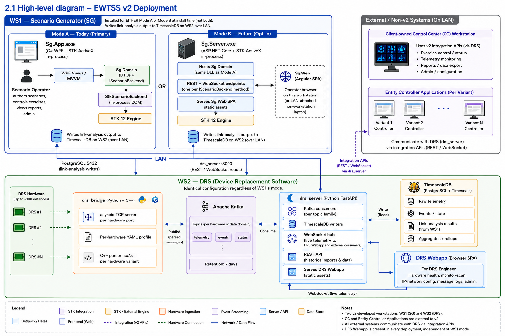

# EWTSS v2 — Design Review Brief

**Audience:** CEO, CTO, engineering team (leads + ICs).
**Purpose:** structured pre-read for the v2 design review meeting. Goes deeper than the 5-min [Executive Brief](executive-brief.md): covers architecture, constraints, performance evolution, known limitations, future expansion, effort and slip risks, and the layered-architecture standardization opportunity for other projects.
**Read time:** ~25 minutes.
**Status:** v2 architecture is fully designed and partially built (MVP4.5 ships the desktop authoring core). The v2 hardening phase (telemetry pipeline) is awaiting funding approval — this brief is the pre-read for that decision-grade conversation.

> *The PNG above may lag the docs after architectural updates. The version-controlled, always-current source is [architecture-diagram.md](architecture-diagram.md) (Mermaid block renders in GitHub). When the PNG and the Mermaid disagree, the Mermaid is authoritative; the doc also includes a redraw specification for whoever maintains the PNG.*

---

## 1. Headline

EWTSS v2 is a greenfield rebuild of the existing Electronic Warfare Test & Support System. It is a Windows-based defence simulation system: operators on a workstation pair (WS1 + WS2) author scenarios against STK 12, run pre-computed link analysis, and capture live telemetry from up to 100 DRS hardware instances at 10–20 Hz each. The current v1 production system has two structural problems we are solving: telemetry write performance degrades after ~10 minutes of sustained load (root cause is per-row PostgreSQL commits saturating the connection pool plus synchronous SQLAlchemy blocking the FastAPI event loop — full anti-pattern catalogue in the [Legacy System Audit](legacy-system-audit.md)), and adding a new hardware variant requires non-trivial Python plus database changes (~8 files touched per variant).

The v2 build is seven engineers, ~17 weeks, ~4 months of calendar time from kickoff to ship. The architecture and most of the desktop authoring path have already shipped; what remains is the telemetry pipeline plus three new typed entities. The decision-grade question for the CEO is whether to fund those 17 weeks.

This brief drives that conversation by exposing **what we are committing to, what we cannot do under the chosen design, where performance is likely to evolve over time, and what we get back as a reusable platform asset for adjacent projects**.

---

## 2. Architecture — the seven layers and why they matter

EWTSS v2 is best understood as seven horizontal layers that span the entire system, from physical hardware up to the operator's screen. Each layer communicates only with its immediate neighbours; no layer skips levels. This is not documentation-speak — it is an invariant enforced by code review, test fences, and the structure of the DI container.

- **L0 — Hardware / external systems.** DRS hardware devices, the Scenario Data Flow Controller (SDFC), entity controller applications on the LAN, and STK 12 Engine. Third-party black boxes governed by their own contracts (ICDs for hardware; AGI's STK COM interface for STK).
- **L1 — Transport.** TCP/IP over the LAN; 1 Gbps point-to-point between SDFC and the bridge, plus LAN PostgreSQL and WebSocket between the two workstations. No state, no logic.
- **L2 — Protocol bridge.** `drs-bridge` on WS2: asyncio TCP servers, one C++ parser library per hardware variant, a `ResponseRouter` that demultiplexes by session mode. Bidirectional — parses commands from SDFC, emits responses, publishes both sides to Kafka. Per-connection state in coroutines only; no shared mutable state. This is a structural fix for one of v1's worst classes of bug.
- **L3 — Message bus + persistence.** Kafka 3.x KRaft single-broker on WS2 plus PostgreSQL 16 + TimescaleDB 2.x. The bus decouples WS2's high-frequency ingestion from WS1's authoring and analysis, gives us durability for replay, and lets us scale partitions per variant. TimescaleDB hypertables solve v1's query-degrades-with-table-growth problem at the storage layer (chunk exclusion + composite indexes from day one).
- **L4 — Business logic + scenario domain.** `Sg.Domain` (C#): scenario lifecycle, the `IScenarioBackend` interface, `StkScenarioBackend` (the COM adapter), view-models, DTOs, the interaction state machine. Plus `drs-server` services (Python): query / aggregation, broadcast service, RBAC, JWT issuance, PDF reports. **This is the only layer that knows what the system *does*.** Every other layer is plumbing.
- **L5 — API gateway / in-process boundary.** Mode A: the `IScenarioBackend` interface inside `Sg.App`'s DI container, plus `Sg.App`'s scenario publisher HTTP endpoint (exec-only). Mode B (future): `Sg.Server` ASP.NET Core. Always: `drs-server` FastAPI REST + WebSocket + auth. Thin — route handlers validate input and marshal responses, never perform business logic themselves.
- **L6 — Presentation.** Two surfaces, one per operator persona. **SG-side** on WS1 for the Scenario Operator: today `Sg.App` (C# WPF + STK ActiveX in WindowsFormsHost); future opt-in `Sg.Web` (Angular SPA + CesiumJS). **DRS-side** on WS2 for the DRS Engineer: a browser-based webapp served by `drs-server` (Angular preferred per [ADR-018](decision-record.md#adr-018--ws2-drs-webapp-required-browser-frontend-on-the-drs-workstation-served-by-drs-server), React acceptable fallback). Both bind through L5.

The two workstations split cleanly: WS1 hosts the SG-side L4–L6 plus its in-process L5 boundary; WS2 hosts L2–L5 (drs-bridge, Kafka, TimescaleDB, drs-server) plus L6 (DRS webapp served locally). Cross-LAN traffic is only L4(WS1) ↔ L3(WS2) (PostgreSQL writes) and L5(WS2) ↔ L6(WS1) (drs-server REST + WebSocket reads to SG-side frontend) — point-to-point, not service-to-service. The DRS webapp talks to drs-server in-workstation; no cross-LAN traffic for that pair. Two external systems (Control Center and Entity Controller Applications) also sit on the LAN but are client-owned, with integration APIs from SG and/or DRS that v2 exposes (specific surface TBD per CC integration requirements).

**Why this layering is the right answer for EWTSS specifically:** v1 broke at the boundaries. The audit found multiple instances of L4 components reaching past L3 to call each other synchronously over HTTP (AP-1 / AP-9 / TS-1 / TS-4 in the audit) — that is the structural cause of the 10-minute telemetry collapse, not a tuning issue. v2's load-bearing rules (no `def` route handlers, no `query.all()` on hypertables, manual offset commit only after successful DB write, no synchronous cross-service HTTP on high-frequency paths) exist because each one maps to a v1 production failure. The architecture is not a preference; each rule has a debugging session behind it.

Detailed component-level layered diagrams for Mode A, Mode B, and the telemetry pipeline are in [Architecture Overview §2.4–§2.5](architecture-overview.md#24-software-architecture-layers).

---

## 3. The constraints — what the design commits us to

These are the load-bearing constraints. Each constrains design choices going forward; each was deliberately accepted because the alternative was worse.

**One STK Engine licence seat per deployment, hosted on WS1 only.** WS2 has no STK. This makes the licensing economics tractable and means the "two STK processes in the same deployment" failure mode is unreachable by construction. The cost: Mode A and Mode B cannot coexist on a single deployment — the install commits to one or the other, and switching is a reinstall on WS1, not a runtime toggle. See ADR-005, ADR-012.

**STK COM is in-process, single-threaded STA.** Microsecond method-call latency, native typing of the STK API. The cost: the application must be Windows-only, must run as a single process per workstation, and the integration test tier requires STK installed on the test host (no managed mocks). On STK 12.9 specifically, a single process can host only one `AgSTKXApplication` lifecycle — init → dispose → init in the same process crashes natively. The test infrastructure works around this with a fixture-level shared backend; the production app touches it only once at startup. See ADR-005.

**Typed entity DTOs over metadata-driven generic editors.** Each STK entity type has its own DTO, view-model, and WPF panel. Adding a new type costs ~8 files of boilerplate (~1.5 days). We evaluated a metadata-driven JSON-descriptor editor and rejected it: at EWTSS's scale (~10 entity types, fixed catalogue) the compile-time safety and audit clarity matter more than per-entity boilerplate savings. See ADR-007 and the [metadata-driven editor evaluation](specs/metadata-driven-entity-editor-evaluation.md) for the rejection reasoning, plus the explicit revisit triggers if scale changes.

**No permanent COM event subscriptions on STK ActiveX controls.** Every permanent subscription to `MouseDownEvent` / `OnObjectEditing*` costs ~1–2 seconds of post-pan-release latency, regardless of handler body. The architecture mandates on-demand subscription only — events subscribe when entering placement / editing mode, unsubscribe on return to Idle. This was learned the hard way in MVP4 → MVP4.5 and is load-bearing for the desktop UX promise. See ADR-013.

**No `def` route handlers in `drs-server`; only `async def`.** A synchronous handler in an async FastAPI app blocks the event loop, which on v1 produced the 200-msg/s degradation cliff. Every route handler in v2 is `async def`, returns from a service rather than embedding the query, and never holds a DB session across `await` boundaries. Enforced by code review and the cumulative integration test suite.

**Pre-computed batch link analysis, not real-time.** Scenarios are authored, then computed offline (per-tick STK link analysis written to a `computed_links` hypertable), then replayed during exercise execution. We do not compute live during exercise. This caps the compute load per workstation and makes Integrated-mode latency budgets achievable. The cost: scenario authoring → compute → execution is a three-step workflow, not a single edit-and-run.

**Air-gapped LAN, two workstations, DVD delivery with vendored dependencies.** No internet at the customer site. All Python wheels are pure-Python or have OS-specific wheels we ship; all dependencies live under `packages/` and install via `pip install --no-index --find-links=packages/`. Every dependency we adopt becomes a vendoring cost — a real consideration when picking libraries.

---

## 4. Known limitations of the current design

Limitations the design *deliberately* accepts. The CEO should walk into the meeting knowing these, because each one will eventually be a customer question.

**Mode A is single-user per workstation.** Two operators cannot author the same scenario simultaneously on one WS1. The architecture does not model multi-user concurrency anywhere in the L4 domain layer. If the customer asks for multi-author or simultaneous-edit support, that is a from-scratch design pass on top of v2 — not a configuration change.

**No live DRS telemetry overlays in MVP4.5 today.** Mode A's MVP4.5 ships scenario authoring and pre-computed link visualization, but the live-telemetry display panels are part of the v2 hardening phase, not what is shipped today. An MVP4.5 demo this week would show authored scenarios and STK FOM grid colouring, not live telemetry.

**No SG-side browser delivery today.** The SG frontend's browser path (Mode B: Angular + CesiumJS SPA + ASP.NET Core server) is fully designed and ~90% of the contract-boundary plumbing has already shipped, but the actual server and SPA are deferred until a customer asks. We can deliver Mode B in ~1.5 months (read-only viewer) + ~3 months (full authoring) once funded — but if no customer ever asks, that capability lives as cold code. **The DRS-side webapp on WS2 is required in every deployment** and is separate from the Mode A / Mode B selection for the SG frontend.

**No real-time scenario compute.** Compute is a one-shot pre-execution step writing to `computed_links`. Operators cannot fly an entity around mid-execution and watch link analysis re-run live. If the customer ever asks for that, it is a fundamentally different STK integration pattern.

**Only one STK sensor pattern (Simple Conic) and one propagator type (Great Arc) in MVP4.** STK supports many more. Adding additional patterns / propagators is straightforward (one DTO + one update path per addition) but it is per-addition work, not a generic capability.

**STK version pin per deployment.** STK 12.9.1's COM API has version-specific quirks (~14 documented gotchas in the v2 archive §25.3.5). When AGI ships a new STK 12.x patch or 13.x, the integration test tier surfaces breaks — but real customer upgrades are coupled to retesting. We do not promise forward compatibility across STK majors.

**Single Kafka broker (KRaft single-node).** Throughput target is 2,000 msg/s sustained, well within single-broker capacity. Scaling out is operational (add brokers, increase partitions), not a redesign — but it is not a day-one config option. A future deployment needing >5,000 msg/s is a deployment-engineering exercise, not a code change, but it does need someone to do it.

**No cross-deployment scenario sync.** Each WS1 owns its own scenario files (`.sc`, `.vdf` on disk). Two customer sites with two WS1s cannot share scenarios except by file transfer. Mode B would naturally support a server-side scenario store, but that is a Mode B activation concern.

---

## 5. Performance — where the design holds, where it might strain later

The v2 architecture clears v1's known performance ceilings by structural change, not tuning. Past v2's ship date, four forward-looking concerns will need monitoring.

**v1 vs v2 ceilings — what we know we have fixed.** v1 collapses at ~10 concurrent instances, ~200 msg/s, after ~10 minutes. v2 is designed for 100 instances, 2,000 msg/s sustained, indefinite duration. The mechanism: asyncio replaces thread-per-client (no GIL contention), batched DB writes (100 messages or 500 ms) replace per-row commits, async SQLAlchemy + asyncpg replace synchronous SQLAlchemy, TimescaleDB hypertables replace single-table PostgreSQL. Each is a structural fix mapped one-to-one against a v1 anti-pattern; the [Legacy System Audit](legacy-system-audit.md) has the AP-1…AP-15 evidence with file:line citations.

**Forward concern #1 — Path 3 cross-LAN latency in Scenario mode.** During exercise execution, `drs-bridge`'s `ResponseRouter` calls `Sg.App`'s scenario publisher endpoint per SDFC command (~10–17 ms p99 over LAN: HTTP round-trip + Sg.App's PostgreSQL lookup of the matching `(group_id, unit_id, tick)`). For typical IRS budgets this is comfortable. But under sustained Integrated-mode load — entity-app responses on the wire concurrently with telemetry writes — the cross-LAN PostgreSQL could contend and push p99 toward the IRS budget. We measure this explicitly at Phase 4 and Phase 5 of the integration test (weeks 11 and 13 of the build) with p99 ≤ 30 ms gates. If exceeded, the targeted mitigation is an in-memory `computed_links` cache on Sg.App (drops p99 to <1 ms, costs ~36 MB per 1-hour scenario, implementable in 2–3 days). **We deliberately do not pre-optimise** — implement only if measurements warrant. See [v2 Execution Plan §3.3](v2-execution-plan.md#33-b-c-specialist--sgapp-extension).

**Forward concern #2 — STK Engine cold-start tax.** Cold-starting STK takes 15–60 seconds depending on GPU profile. Today's MVP4.5 hides this behind a splash window with progress messages. As scenarios get larger and STK feature usage grows, cold start can creep upward. Mitigation: GPU preference must be set at deployment (per [Deployment Guide §4.3](deployment-guide.md#43-gpu-preference-setup-critical)); cold start is a deployment quality item, not a per-run concern. Worth monitoring at customer-acceptance.

**Forward concern #3 — TimescaleDB chunk-exclusion drift.** TimescaleDB's per-query performance depends on chunk exclusion — queries only scan time chunks that overlap the query window. This is automatic and works well, but only if queries always include a time predicate. If a future feature ships a `query.all()`-style scan, latency reverts to v1-style table-scan behaviour. Code review enforces this — the rule "no `query.all()` on hypertables" is in the developer handbook and the PR checklist. It is a discipline item, not a structural one.

**Forward concern #4 — STK compute capacity per deployment.** A deployment hosts one STK Engine instance. Compute is single-threaded inside that instance. For scenarios with 1,000+ entity-emitter pairs and per-tick compute at 1 Hz, a single instance can become a wall-clock bottleneck. v2 scenarios in scope are well under that. If a customer ever asks for an order-of-magnitude bigger scenario, the conversation is "compute on a separate workstation, deliver `.sc`" or "schedule compute overnight" — not a code change.

One thing we explicitly do not promise: sub-millisecond control loops. EWTSS is a simulation system, not a hardware-in-the-loop test bench. The latency budgets are 10s of milliseconds end-to-end, not microseconds.

---

## 6. Future expansion scope

Three expansion vectors, in order of likely customer demand.

**1. Mode B (browser delivery) activation.** ~90% of the work to enable Mode B already shipped in MVP4.5 — the DTO contracts, the `IScenarioBackend` boundary interface, the JSON round-trip tests, the namespace-fence integration test that fails the build if a COM type leaks into the contracts namespace. The remaining 10%: `Sg.Server` (ASP.NET Core mapping endpoints to interface methods), `Sg.Web` (Angular + CesiumJS SPA mirroring the C# view-models), the OpenAPI contract, GIS tile pipeline. Estimated 1.5 months (read-only viewer) + 3 months (full authoring). Activated on customer signal; the C# track does not pay this cost twice. Detailed activation checklist in [Architecture Overview §9.1](architecture-overview.md#91-mode-b-activation-checklist).

**2. Additional hardware variants beyond the 12+ scoped.** The architecture is built so that adding a variant is a YAML profile plus a C++ parser library. No Python changes, no `drs-server` changes, no UI changes. First variant takes ~3–5 days; subsequent variants are ~1.5–3 days each (faster with the [ICD codegen tool](specs/icd-codegen-tool-design.md) from variant 3 onward). Customers can add variants post-acceptance for a per-variant fee without architectural risk.

**3. New STK entity types beyond Aircraft / Facility / AreaTarget / Sensor / Coverage / FOM / Transmitter / Receiver / Antenna.** ~1.5 days per type (DTO + view-model + WPF panel + IScenarioBackend methods + tests). The typed-not-metadata decision means each addition is mechanical, not architectural.

Three more theoretical vectors that would be significant work, not in scope and not on roadmap unless a customer drives them:

- **Real-time scenario compute** (mid-execution authoring with live recompute). Different STK integration pattern; would change ADR-005 / ADR-012 economics.
- **Multi-user authoring** (concurrent edits on one scenario, OT / CRDT layer). Would require an audit-of-everything pass through L4 to remove single-user assumptions.
- **Cloud delivery** (multi-tenant, internet-facing, customer SaaS). Out of scope by RFQ; the air-gapped LAN constraint is load-bearing for the whole design.

---

## 7. Effort estimates and where things might slip

**Headline:** v2 hardening is **17 weeks, 7 engineers**, ~4 months of calendar time from kickoff to ship. Detailed staffing and per-person ownership in [v2 Execution Plan §2 + §3](v2-execution-plan.md#2-team-composition). The team is already in place: one senior Python developer (F), one Python+C# polyglot (A), one C# specialist (B), one C++ specialist (C), one cross-stack lead / reviewer (D), one Angular developer cross-trained to Python during ramp (E, SG-side), one Angular-preferred / React-fallback developer for the DRS webapp on WS2 (G).

**Critical path:** parser ABI contract (~~week 2~~ **closed 2026-05-21**, see [`drs-bridge/parsers/reference/`](../../drs-bridge/parsers/reference/)) → first end-to-end message flow (week 5) → ResponseRouter round-trip (week 5+) → Scenario mode round-trip (weeks 9–11) → full integration test (weeks 16–17). The C++ parser ABI is no longer a critical-path risk — a buildable 4-symbol reference implementation now ships with CMake + pytest integration test (CI-green); first-variant work copies + modifies that template instead of inventing the ABI from prose.

**Phased build with integration-test gates at every phase.** Each phase ends with a cumulative integration test — Phase N does not pass until Phase N's test plus every prior phase's test all pass on a clean checkout. This surfaces regressions early and gives the project sponsor visibility into actual progress, not just velocity-against-plan. Full per-phase test scope and pass criteria in [v2 Execution Plan §6](v2-execution-plan.md#6-integration-testing-checkpoints).

**Two pre-build risks have already been retired:** the team is in place (no hiring slip on the critical path), and STK Components / compute capability is confirmed bundled in the customer's runtime licence (R4 verified). The residual slip risks worth surfacing, in order of likelihood × impact:

1. **STK COM 12 patch-version drift breaks Sg.App mid-sprint.** R3. The ~14 documented gotchas are version-sensitive; an STK 12 patch from AGI mid-build could change behaviour silently. Mitigation: pin STK 12 minor version per dev environment; CI integration tier on the pinned version.
2. **Customer scope expansion mid-build.** P3 in the risk register. Mid-build requests for additional hardware variants or features. The architecture absorbs these well (new variants are YAML + C++ skeleton; new entity types are mechanical ~1.5 days each), but each is chargeable scope and consumes calendar time on the critical path if not absorbed by a deferred-to-maintenance item. Mitigation: scope-change protocol with the customer programme manager — any addition is logged, estimated, and chargeable; daily-build branches preserve mid-stream state if a redirect is requested.
3. **DRS webapp framework decision slips past week 2.** G's scaffolding cannot begin until Angular-vs-React is signed off; every week of delay compresses G's downstream surfaces (monitor-scan, log viewer, IP config) against the back end of the build. Mitigation: framework-decision gate at end of week 1 (not end of week 2) with project-lead final call; D pre-evaluates both options in week 0; if G's primary skill is React, default to React with no further escalation.
4. **E's Python ramp does not complete in 2 weeks.** REST endpoints + RBAC + PDF reports compress against the wall in weeks 14–17 if ramp slips. Mitigation: pair E with F intensively week 1–2; F absorbs REST endpoint scope if needed, and PDF reports drop to minimum (defer admin UI to maintenance).
5. **Path 3 latency exceeds IRS budget under Integrated load.** Measured at Phase 4 (week 11) and re-measured at Phase 5 (week 13). If p99 > 30 ms, engage the in-memory cache mitigation (2–3 days, pre-specified). This is a contingent task, not a slip risk — the design already anticipates the failure mode and has the fix ready.

The risk register tracks 10 active engineering risks (R1–R10) and 5 active programme risks (P1–P5) plus deferred Mode B–activation risks. Each has owner, mitigation, and trigger conditions; the register lives at [risk-register.md](risk-register.md).

**One observation worth surfacing to the CEO:** with the team in place and the STK Components licence verified, the residual slip risks are predominantly *external* (customer scope adds, STK 12 patch drift) rather than *internal* (engineering team capability or architecture validity). Every load-bearing architectural decision is backed by working code from one of MVP1–MVP4.5; the two largest pre-build risks (staffing and runtime-licence scope) are already retired. We are not betting on architecture validation, staffing, or licensing during the build — only on execution against external dependencies we can monitor and respond to.

---

## 8. Standardization — what this becomes for other projects

The seven-layer model in §2 is not EWTSS-specific. It maps onto any system that combines (a) hardware data ingestion at the L0–L3 boundary, (b) domain logic over time-series data at L3–L4, and (c) authoring + visualization at L5–L6. We have at least three projects in adjacent product lines that fit this shape. The v2 build can be structured to produce reusable platform components for them at marginal cost.

The candidate reusable assets:

1. **The asyncio bridge pattern (L2).** `drs-bridge`'s structure — asyncio TCP server, per-connection coroutine state, supervised C++ parser loader (`.dll`), Kafka publisher with manual offset commit only after successful downstream write — is the canonical "bytes in, structured messages out" pattern for any hardware-ingestion service. The four-symbol C++ ABI (`extract_frame` / `parse_message` / `format_response` / `free_result`) plus the YAML profile schema is a platform contract, not an EWTSS contract.

2. **The ICD codegen tool.** [Designed in spec form](specs/icd-codegen-tool-design.md): takes an Excel ICD as input, emits C++ constants headers + YAML profile skeleton + TypeScript type definitions. Accelerates new variant onboarding from days to hours. Applicable to any project where third-party hardware ICDs are the spec-of-record.

3. **The DTO + interface boundary pattern (L4–L5).** `IScenarioBackend` + DTO Contracts + JSON round-trip tests + namespace-fence integration test is the pattern for any domain where (a) you have an in-process desktop reference implementation and (b) you want browser delivery to be opt-in additive, not a from-scratch rewrite. The structural property — that the boundary is testable with a fake in <1 ms per call without the heavy backend — is what makes the desktop and future-browser paths share a test suite.

4. **The TimescaleDB schema + write-batching pattern (L3–L4).** Hypertables with composite indexes from day one, batched writes (100 messages or 500 ms or partition-flush), manual offset commit only after successful DB write, query-must-have-time-predicate code-review rule. This is the structural fix for the v1 "logs degrade with table growth" anti-pattern in any system, not just EWTSS.

5. **The phased integration test rig with cumulative regression.** Phase N's test = Phase N's new scope + every prior phase's test, run on a clean docker-compose-spun environment, gated before forward motion. The rig structure (SDFC simulator + synthetic Kafka producer + multi-instance simulator + STK fixtures) is reusable wholesale for any system with multiple cooperating services and external hardware simulation. Adopting this discipline early on a new project surfaces architectural problems before they are load-bearing.

6. **The MVP-validated architecture pattern.** Five sequential MVPs (MVP1–MVP4.5) validated each load-bearing architectural choice empirically before commitment. Each ADR in the decision record cites the MVP that proved (or invalidated) it. For any greenfield rebuild of an existing system, this approach — validate-then-commit, preserved as git branches for audit — beats whiteboard architecture every time.

**What to do with this:** at v2 ship, harvest these six into a platform-engineering catalogue separate from EWTSS itself. The harvest cost is mostly documentation (each pattern needs a "how to apply to a new project" guide); the engineering work is already done.

If the CEO wants a single line for this: **EWTSS v2 is structured so that every load-bearing architectural choice is also a platform asset.** Mode B optionality is one example; the asyncio bridge pattern, the codegen tool, the boundary discipline, the TimescaleDB pattern, and the phased test rig are the others.

---

## 9. Asks for the design review

What we want to leave the meeting with:

1. **Approval of the Hybrid architecture as the v2 frontend strategy.** Desktop-primary today (MVP4.5 shipped), browser-deferred (Mode B activates on customer signal). Documented in ADR-001, validated empirically in MVP3 + MVP4 + MVP4.5.
2. **Approval to begin the v2 hardening phase.** 17 weeks, 7 engineers (team in place: F, A, B, C, D, E on the SG and infrastructure side; G on the DRS-side frontend), ~4 months of calendar time from kickoff to ship. Phased build with integration-test gates at each phase. Team kicks off immediately on approval.
3. **Acknowledgement of the residual slip risks** (STK 12 patch-version drift, customer scope expansion, DRS webapp framework decision timing) with the CEO accepting the mitigations as-stated or proposing alternatives. The two largest pre-build risks (team hiring and STK Components licensing scope) are already retired.
4. **Greenlight to begin harvesting the six reusable platform assets in §8** as a parallel low-priority track during v2 build, with deliverables landing post-ship.
5. **Defer SG-side Mode B activation** until a customer signal warrants it. No engineering work allocated until then. (The DRS-side webapp on WS2 is required and included in the v2 hardening phase scope — independent of the SG-side Mode A / Mode B choice.)

What we explicitly are NOT asking for:

- A real-time-compute capability commitment.
- A multi-user authoring commitment.
- A cloud-delivery commitment.
- Customer-specific extensions to STK Engine usage beyond Simple Conic + Great Arc.

---

## 10. References

- [Executive Brief](executive-brief.md) — 5-min summary for sign-off.
- [Architecture Overview](architecture-overview.md) — 20-min deeper read for the technical reader.
- [Decision Record](decision-record.md) — 19 ADRs covering every architectural commitment.
- [v2 Execution Plan](v2-execution-plan.md) — staffing, parallel workstreams, critical path, integration test gates.
- [Risk Register](risk-register.md) — active, retired, and deferred risks.
- [Operator Playbook](operator-playbook.md) — workflow-level operator-facing description with RFQ traceability matrix.
- [Design Backlog](design-backlog.md) — Milestone-1 design items required before / alongside the v2 hardening phase.
- [v1 Legacy System Audit](legacy-system-audit.md) — anti-pattern catalogue with file:line citations and v2 structural fixes.
- [Hybrid design spec](specs/hybrid-frontend-design.md) — Mode A primary + Mode B opt-in future.
- [ICD codegen tool design](specs/icd-codegen-tool-design.md) — the Excel-ICD-to-skeleton tool referenced in §8.
- [v2 tech-stack archive](specs/v2-tech-stack-archive.md) — exhaustive original analysis (~5,000 lines).
- High-level architecture diagram: `ewtss_v2_high_level_architecture_diagram.png` (in this directory).
