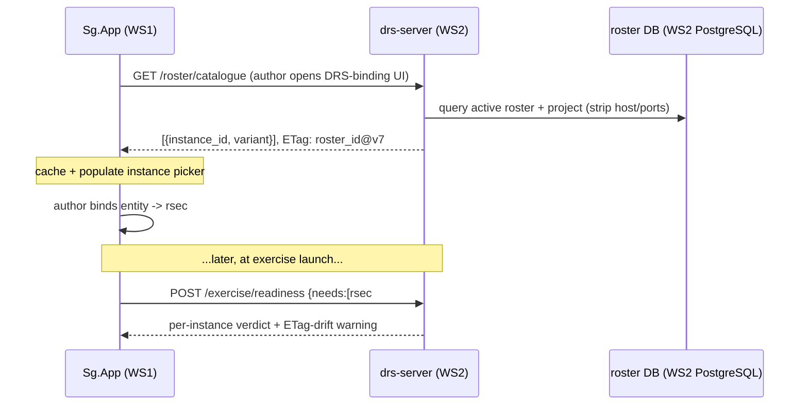

# DRS Instance Addressing & Discovery — Design Spec

**Date:** 2026-06-04
**Status:** Approved (user-confirmed scope 2026-06-04 — mixed port authority, per-instance addressing, WS2 deployment-config source of truth, author-time binding by logical id, export-only ECS discovery, **hybrid roster store: DB live + YAML export/import**)
**Author:** architecture review (brainstorm pass; new gap — see §2)
**Tracking:** [B1.43](../design-backlog.md)

## 1. Goal

Define how Entity Controller (ECS) applications connect to the correct DRS instance on WS2 in Integrated mode: how an ECS learns which **port** to connect to, how the system guarantees that the **right kind of DRS instance** is behind that port, and how the WS1 scenario's logical participants stay in sync with the WS2-side instance roster.

**Audience:** A (drs-bridge — owns the per-instance transport + roster consumer/hot-reload), E (drs-server — owns the roster store, API, export/import + launch reconcile), B (Sg.App — owns the catalogue cache + readiness panel), G (DRS-webapp — owns the IP/network-config editing surface), F (DB schema for `roster` / `roster_entry` / `roster_revision`), D (cross-stack lead — reviews the WS1↔WS2 contract).

## 2. Context

The v2 design treats Entity Controller Applications (RDFS, JV-UHF, JHF, SJRR, JLB, JMB, JHB-variants, AUS, PADS) as client-owned LAN nodes that DRS exchanges IRS-compliant TCP/UDP messages with in Integrated mode ([operator-playbook §12.2](../operator-playbook.md#122-entity-controller-application-integration-)). The runtime mechanism exists in skeleton form:

- Each variant has a YAML profile ([`rdfs.yaml`](../../../drs-bridge/src/drs_bridge/profiles/rdfs.yaml)) that, today, hard-codes one `command`/`response` port pair.
- [`runtime.py`](../../../drs-bridge/src/drs_bridge/runtime.py) loads all profiles at startup and binds **one TCP command server per variant**; the comment in [`transport.py`](../../../drs-bridge/src/drs_bridge/transport.py) confirms the ECS is the TCP client and the DRS instance is the server.

What's **missing** is the addressing and identity layer around that mechanism:

1. **No per-instance model.** The architecture commits to "up to 100 DRS instances" with multiples per variant (the `RSEC × N` / `JHB×4` in the topology), but the code binds one server per *variant* (~12), not per *instance*.
2. **No discovery story.** Port numbers are static constants in per-variant YAML; nothing tells an ECS which port to connect to, and nothing reconciles those ports with the scenario authored on WS1.
3. **No identity guarantee.** An ECS that connects to a port has no in-band confirmation that the expected variant/instance is behind it, and DRS has no defence against a misconfigured ECS connecting to the wrong port.

This spec closes that gap. It is a new design item (not previously in any v2 doc); [B1.43](../design-backlog.md) tracks it.

## 3. Scope and non-scope

**In scope:**
- The **logical instance id** as the shared identifier across WS1 scenarios, the WS2 roster, logs, and Kafka routing.
- A WS2 **deployment-level roster** that instantiates each variant template N times with per-instance addressing, stored live in PostgreSQL and edited at runtime via the DRS-webapp, with YAML export/import for version-control + provisioning.
- Two projections of the roster: a port-free **id catalogue** for WS1 authoring, and a host:port **addressing table** export for configuring client ECS apps.
- The **launch-time reconcile** (`/exercise/readiness`) as the single WS1↔WS2 sync moment for Integrated mode.
- drs-bridge changes from per-variant to **per-instance** servers, with per-instance lifecycle (hot-reload on roster change / restart / failed-bind isolation / clean teardown).
- The **identity model**: deterministic port→instance binding + framing probation + launch reconcile.
- The cross-repo **contract artifacts** this introduces (`drs.roster` Kafka message schema, `/roster/*` + `/exercise/readiness` OpenAPI) registered in [`contracts/`](../../../contracts/) per [B1.26](../design-backlog.md), so drs-server (producer) and drs-bridge (consumer) cannot drift.

**Out of scope (deferred or covered elsewhere):**
- **CC integration API** ([B1.4](../design-backlog.md)) — a different external boundary (Control Center, not Entity Controllers).
- **Per-variant IRS wire protocols** — framing/command layouts live in each variant's IRS + parser ([ICD reference](../icd-reference-comm-df.md)); this spec is transport-agnostic above the frame.
- **Readiness-panel UX detail** — the operator-facing panel shape is [B1.9](../design-backlog.md); this spec defines the data contract it renders.
- **Source-IP / peer authentication** — deliberately not built (see §8 decision log + §10 future extensions). YAGNI until an RFQ requires it.
- **Network-partition resilience during a running exercise** — reconnect/backoff/pause is [B1.37](../design-backlog.md); this spec covers connection establishment + launch-time reachability, not mid-exercise partition recovery.

## 4. Decisions (settled in brainstorm)

| # | Decision | Rationale |
|---|---|---|
| D1 | **Port authority is mixed per variant.** The design honours IRS-fixed ports where the client's IRS dictates them and allocates ports where we are free. | Client hardware varies; some IRSs fix the port, others leave it to the integrator. |
| D2 | **Addressing is per-instance, not per-variant.** Each of up to ~100 instances gets its own `host:port` + identity. | "Many instances per variant" — `rsec#1`, `rsec#3` are distinct endpoints. |
| D3 | **WS2 deployment config is the source of truth** for the instance roster. | Stable site inventory; matches the DRS-webapp "IP/network configuration per variant" surface. |
| D4 | **Scenarios bind to instances author-time by stable logical id**, resolved to ports only at launch. | Decouples scenarios from ports — a WS2 port change never invalidates a stored scenario. |
| D5 | **ECS discovery is export-only.** WS2 publishes an authoritative addressing table the client configures ECS from; we require nothing of client-owned ECS apps beyond their IRS. | ECS apps are external and client-owned; we cannot add handshakes/calls they don't already specify. |
| D6 | **Identity is enforced WS2-side** by deterministic port→instance binding + framing probation + the launch reconcile. **No source-IP allowlist.** | Off-by-default peer-checking earns nothing today; removed for simplicity (see §8). |
| D7 | **Variant profile stays a pure template; the roster is separate deployment config.** | Preserves the "1 YAML profile + 1 parser per variant" invariant; the roster (DB-backed, D8) holds per-site instance data, the profile holds the per-variant template. |
| D8 | **Hybrid roster store: the DB is the live store; YAML is the export/import format.** Rosters live in WS2 PostgreSQL (`roster` / `roster_entry` + an append-only `roster_revision` history); the DRS-webapp edits them at runtime through drs-server. YAML export/import is the version-control + provisioning + offline-diff format. Selectable via an `is_active` pointer. Variant *profiles* stay files. | The RFQ requires the DRS engineer to configure IP/network per variant at runtime ([B1.1](../design-backlog.md)); a DB is native for transactional webapp edits + per-change audit (mirrors [`scenario_compute_snapshots`](scenario-management-design.md)). YAML export/import preserves the diffable/reviewable/reproducible artifact and air-gap provisioning. Logical-id binding (D4) keeps every scenario portable across rosters — only resolved `host:port` differs. (Reverses the initial file-only D8; see §8.) |

## 5. Data model

### 5.1 The logical instance id

A stable string `"<variant>#<n>"` (e.g. `rsec#3`, `jhf#1`). It is the single identifier shared across WS1 scenarios, the WS2 roster, logs (Sent/Receive Message + System), and Kafka topic routing. **It never encodes a host or port.** This is the vocabulary a scenario entity uses to name which DRS instance drives it (referenced by [B1.15](../design-backlog.md) side mapping and [B1.25](../design-backlog.md) typed-entity DTOs).

### 5.2 The live store (DB) and its projections

The roster's **live source of truth is WS2 PostgreSQL**. Everything else is a projection or an exchange format.

| Artifact | Lives on / form | Contains | Role |
|---|---|---|---|
| **`roster` / `roster_entry` tables** (source of truth) | WS2 PostgreSQL | `roster(roster_id, name, version, is_active, updated_at, updated_by)`; `roster_entry(roster_id FK, instance_id, variant, host, command/response port + protocol, port_source (irs_fixed \| allocated), enabled)` | the live, webapp-editable store |
| **`roster_revision`** (append-only history) | WS2 PostgreSQL | one row per committed change: `roster_id, version, changed_at, changed_by, snapshot_json` | audit + rollback (mirrors [`scenario_compute_snapshots`](scenario-management-design.md)) |
| **YAML export** (`rosters/<name>.yaml`) | file, version-controlled | `roster_id`, `version`, `entries[]` | provisioning seed, offline diff, version-control snapshot, air-gap transport |
| **Addressing table** (client-facing) | exported file/PDF | `instance_id → host:port, protocol` | configures client ECS apps |
| **Id catalogue** (WS1 authoring) | pulled by WS1 over REST | `instance_id → variant` (port-free) + ETag (`roster_id@version`) | populates the author's instance picker |

The variant profile **loses** its `ports:` block — ports move to the roster. The profile keeps `variant`, `parser_lib`, `time_signal`. A roster entry references a profile by `variant` and supplies per-instance addressing.

A deployment may hold **multiple named rosters** (e.g. `lab-full`, `bench-rdfs-only`); exactly **one is active** (`is_active`), and switching is a webapp action that repoints it. Because scenarios bind by logical id (D4), the same scenario runs against any roster that defines its required ids — switching changes only the resolved `host:port`. The active roster's `roster_id@version` is the ETag the launch reconcile checks (§6.4), so a scenario authored against a different roster than the one now active is flagged before the run.

### 5.3 Schemas

**drs-server (DB + API):** owns the `roster` / `roster_entry` / `roster_revision` tables and the Pydantic request/response models for the write + export/import endpoints (§6.2). It is the validator + writer of record.

**YAML export/import schema:** a `Roster` document (`roster_id`, `version`, `entries: list[RosterEntry]`). The same shape drs-server exports and re-imports, and the shape a commissioning seed file takes.

**drs-bridge (consumer):** [`profiles/_schema.py`](../../../drs-bridge/src/drs_bridge/profiles/_schema.py) gains the `Roster` / `RosterEntry` Pydantic models (reusing `PortConfig`) used to **deserialize + re-validate** the active roster it *receives from drs-server* (§6.1), not a file it loads from disk. The variant `VariantProfile` drops `ports` and keeps `variant`, `parser_lib`, `time_signal`. (The legacy file-loading path is replaced; `profile_loader.py` still loads the per-variant templates from disk.)

### 5.4 Roster validation rules

The same rules are enforced **authoritatively by drs-server on every write/import**, and **defensively by drs-bridge** on the roster it receives:

- `instance_id` is unique within the roster.
- No two enabled instances share a `host:port`.
- An `irs_fixed` entry must carry an explicit port (no auto-allocation for IRS-fixed).
- An `allocated` entry may carry an explicit port or take a deterministic one from an allocation base.
- Every entry's `variant` matches a loaded profile (no orphan instance naming a variant with no template).
- **Exactly one roster is `is_active`** at any time; repointing the active roster atomically clears the previous one (a partial unique index enforces it).

A write/import that violates any rule is **rejected by drs-server** (the edit doesn't commit; the webapp shows the offending instance). On the consumer side, drs-bridge isolates a bad entry to `FAILED_BIND` rather than refusing all instances (§7.3) — a published roster has already passed server-side validation, so a consumer-side failure is an environment problem (e.g. port taken by an OS process), not a malformed roster.

## 6. Components & flows

### 6.1 drs-bridge — per-instance servers

drs-bridge **receives the active roster from drs-server** (it holds no DB client and reads no roster file). The active roster is delivered over the Kafka control-plane — a compacted `drs.roster` control topic drs-server publishes to — so drs-bridge consumes the latest snapshot at startup and a fresh snapshot whenever the roster changes. drs-bridge already speaks this control-plane ([`control_publisher.py`](../../../drs-bridge/src/drs_bridge/control_publisher.py)); this keeps it DB-free and HTTP-free. (Kafka-vs-REST-pull delivery is a §9 sub-decision; Kafka is preferred.)

On each received roster snapshot, [`runtime.py`](../../../drs-bridge/src/drs_bridge/runtime.py) reconciles its bound servers against the snapshot:

- Load each referenced variant template once and **cache the parser `.dll` per variant** (loaded once per variant, not once per instance).
- Bind one command server + one response sender **per `enabled` instance**, keyed by `instance_id`. `_command_servers` / `_senders` are `dict[instance_id, …]`. A disabled (`enabled:false`) instance is not bound — this is how an operator takes an instance out of service (replacing the earlier transient-override idea with a durable, audited DB flag).
- On a roster change, **diff against currently-bound instances**: bind added/newly-enabled instances, tear down removed/disabled ones, rebind those whose addressing changed — leaving unaffected instances running. This is per-instance **hot-reload**; switching the active roster no longer requires a process restart. **Startup is just the first reload from an empty set** — if no roster has been published yet, drs-bridge binds nothing and binds when the first snapshot arrives.
- The `_on_frame` closure captures `instance_id` (not just `variant`) so every frame is attributed to the exact instance for logging + Kafka routing.

Binding is **mode-independent**: the roster is the physical instance inventory, so per-instance command servers bind whenever drs-bridge is running, not only during Integrated exercises. In Standalone (Random / Scenario) modes no ECS connect, so those servers simply sit idle — no mode-conditional binding logic is needed.

### 6.2 drs-server — roster store, API, export/import, reconcile

drs-server is the **editor + writer of record**: it owns the roster tables, validates every change, and publishes the active roster to drs-bridge.

*Read / projection:*
- `GET /roster/catalogue` → port-free `{instance_id, variant}` + ETag = `roster_id@version` (WS1 authoring).
- `GET /roster/addressing` → `instance_id → host:port, protocol` (rendered to a file/PDF for client hand-off).
- `POST /exercise/readiness` → the launch reconcile: for each required `instance_id`, return `{configured, reachable, time_synced}` + a roster-drift flag (scenario's authored `roster_id@version` ≠ active). **`reachable` is connection-presence, not an active probe** — the command port is inbound-only (ECS is the client), so drs-server reads whether an ECS connection is currently established to that instance from the per-instance health drs-bridge publishes, not by dialing out.

*Write (the RFQ "IP/network configuration per variant" surface):*
- The DRS-webapp edits an entry's host/port/`enabled`, adds/removes instances, or repoints `is_active` — all through drs-server write endpoints. drs-server **validates** (§5.4), commits the row change, **bumps `version`**, appends a `roster_revision` row (audit), and **republishes** the active roster on `drs.roster` → drs-bridge hot-reloads.

*Export / import (version-control + provisioning):*
- `GET /roster/{id}/export` → the `rosters/<name>.yaml` artifact for offline diff / commit / air-gap transport.
- `POST /roster/import` → ingest a YAML document (commissioning seed, restore, or migrate): validate → upsert → new `roster_revision`. Backups are also covered by the existing `pg_dump` DB-backup path ([operator-playbook §11.4](../operator-playbook.md)).

This dissolves the file-vs-live ownership problem: there is one authoritative live store (the DB); YAML is how state enters (import/seed) and leaves (export/backup) it, not a second source of truth.

### 6.3 Sg.App (WS1)

The DRS-binding surface in the scenario tree populates from the cached catalogue; entities bind to logical ids; the readiness panel ([B1.9](../design-backlog.md)) renders the `/exercise/readiness` verdict and **blocks Start until every required instance is green**.

### 6.4 Catalogue pull (WS1 ← WS2)



Properties:
- **On-demand + cached, not polled.** Logical ids change only when site hardware changes. Sg.App fetches when the author opens the DRS-binding surface and caches, with a manual "refresh roster" affordance.
- **Version-stamped (ETag = `roster_id@version`).** The scenario records the `roster_id@version` it was authored against; the launch reconcile warns when that differs from the **active** roster — covering both an edited roster (`rsec#3 renamed/removed since authoring`) *and* a switched roster (`authored against lab-full, bench-rdfs-only is active`). This is where author-time/runtime staleness surfaces — loudly, before the run.
- **Pull is a convenience, not a hard dependency.** If WS1 can't reach drs-server at author time, the author can type a logical id by hand; the launch reconcile is the authoritative backstop. Authoring never hard-blocks on WS2 connectivity — only launching an Integrated exercise does.

### 6.5 The three moments end-to-end

```mermaid
sequenceDiagram
    participant ECS as ECS (client-owned)
    participant B as drs-bridge (WS2)
    participant S as drs-server (WS2)
    Note over S,B: 1. drs-server publishes active roster on drs.roster (Kafka); drs-bridge binds one server per instance
    Note over S: 2. Export addressing table -> client configures each ECS's target port
    ECS->>B: 3. TCP connect to rsec#3's command port (per exported table)
    B->>B: framing probation - provisional until first valid frame
    alt valid frame extracted
        B->>S: register live connection (health = connected)
    else garbage past ceiling / idle timeout
        B->>B: close + log FRAMING_MISMATCH (System + Receive-Message log)
    end
```

"What variant is on this port" is answered three ways that must agree: the **roster** declares it, the **framing probation** enforces variant-level protocol on connect, and the **addressing-table export** is what told the client to point there — one source, projected three ways, so they cannot drift.

## 7. Identity model & error handling

### 7.1 Identity layers

| Layer | Status | Catches |
|---|---|---|
| Deterministic port → instance binding | always (primary) | correct config = correct identity |
| Framing probation (TCP) | always | wrong-*variant* protocol on a port |
| Launch reconcile (`/exercise/readiness`) | always | missing / unreachable / stale-bound instances, before the run |

**Residual limitation (recorded):** with no source-IP check, the in-band guard distinguishes *variants* (via framing) but **not two instances of the same variant** — `rsec#1` and `rsec#3` share framing. A client that misconfigures one RSEC app to the other's port is caught only by the correct exported addressing table + the launch reconcile + operator monitoring, not by the socket. Acceptable for a single-site air-gapped deployment driven from a correct export; see §10 for the hardening hook.

### 7.2 Framing probation (replaces "inspect the first frame")

TCP is reliable and ordered, so a first frame is never *lost* — bytes are segmented/delayed, or the connection drops (which closes itself). The connection is therefore **provisional** until the first valid frame is extracted via the parser's `extract_frame` magic-byte scan ([ICD reference §3](../icd-reference-comm-df.md)):

- **Incomplete** (not enough bytes yet, or a valid prefix) → keep reading. Normal segmentation; never a rejection.
- **Definitive failure** → reject + log `FRAMING_MISMATCH`, close. Definitive = bytes that cannot be valid framing accumulate past a **garbage ceiling** (a few KB / ~2× max frame overhead), or an **idle timeout** elapses with no valid frame. Both bound how long a misconfigured/hostile peer can hold a provisional connection.
- Once one valid frame passes, probation clears and the connection is normal.

For **UDP-inbound** variants (GNSS uses UDP per [ICD reference §2](../icd-reference-comm-df.md)), datagrams can genuinely be lost/reordered and there is no connection to close — framing sanity there is **advisory/logged only**, never fatal.

### 7.3 Failure-mode matrix

| Failure | Detected where | Response |
|---|---|---|
| Two roster entries collide on `host:port` | drs-server on write/import | Reject the edit; webapp names both `instance_id`s. Never committed. |
| `irs_fixed` entry missing a port | drs-server on write/import | Reject the edit (no silent auto-allocation). |
| Roster names a variant with no profile | drs-server on write/import (+ drs-bridge defensive check) | Reject the edit; name the orphan instance. |
| A single instance's port already taken by an OS process | per-instance bind on roster apply | Isolate: that instance → `FAILED_BIND` health; other instances still bind. One bad instance never sinks the service. (Environment problem, not a malformed roster.) |
| ECS connects, wrong-variant framing | framing probation | Reject + `FRAMING_MISMATCH` log past ceiling/timeout. |
| Scenario needs `rsec#3`; roster has no such id | `/exercise/readiness` | `configured:false` → readiness red → Start blocked. |
| Instance configured but ECS not connected at launch | reconcile reads connection-presence health (no outbound probe) | `reachable:false` → operator warned; block-vs-allow-degraded is an exercise setting (§9 open item). |
| Scenario authored against stale catalogue | reconcile ETag drift | Warn with the specific id deltas; operator re-binds or proceeds. |

### 7.4 Time-sync interaction (reuses B1.3)

The reconcile's `time_synced` field reads the existing `SyncStateEngine` per-instance skew; the variant's `precision_required_ms` already lives in the profile's `time_signal` block ([`_schema.py`](../../../drs-bridge/src/drs_bridge/profiles/_schema.py)). A `SYNC_LOST` instance shows amber in readiness, consistent with the B1.3 exercise auto-pause.

### 7.5 Resource discipline (the v1 lesson)

Per-instance servers must tear down cleanly on per-instance restart and on shutdown. The existing [`runtime.py`](../../../drs-bridge/src/drs_bridge/runtime.py) `shutdown()` pattern (close server, `wait_closed`, close sender) extends to the per-instance dicts. No connection or task accumulates across a restart — explicitly in scope given the [legacy leak history](../legacy/ANTI_PATTERNS_AND_PERFORMANCE.md).

## 8. Decision log — features deliberately removed

- **Source-IP allowlist (`enforce_peer`).** Considered as optional/off-by-default hardening, then removed entirely. Off-by-default already meant the default deployment behaved as if the feature were absent, so the plumbing (a roster `expected_peer` field, CIDR validation, a `REJECTED_PEER` path, operational IP maintenance) earned nothing today. YAGNI: add only if a future RFQ requires peer authentication. The natural hook is recorded in §10.
- **Instance self-registration / dynamic registry.** Rejected — D3 makes deployment config the source of truth; a registry adds a moving part with its own lifecycle, and the export-only ECS contract (D5) means ECS apps cannot consume it anyway.
- **Ports embedded in the scenario.** Rejected — violates D4; any WS2 port change would silently invalidate stored scenarios.
- **File-only roster (initial D8).** First settled as version-controlled `rosters/*.yaml` with no DB. Reversed once the RFQ requirement that the DRS engineer edit IP/network per variant at runtime ([B1.1](../design-backlog.md)) was weighed in: a machine-rewritten file isn't meaningfully git-reviewed at runtime, awkward to round-trip from a web form, and creates a file-vs-live ownership conflict on redeploy. The **hybrid** (DB live + YAML export/import, D8) keeps the diffable/reproducible artifact while making runtime edits native and audited. **DB-table-only** was likewise not chosen — losing the version-controllable artifact — so the export/import format is retained as a first-class part of D8.

## 9. Open implementation sub-decisions

These do not block the design; flagged for implementation:

- ~~**Roster delivery to drs-bridge**~~ — **Resolved (Plan 1):** compacted Kafka `drs.roster` topic, key `active`, consumed with `group_id=None` + `auto_offset_reset=earliest` so a fresh consumer always reads the retained snapshot then tails live updates. drs-bridge stays DB/HTTP-free; startup is the first hot-reload from an empty set. Implemented in [`plans/drs-instance-addressing-bridge-plan.md`](../plans/drs-instance-addressing-bridge-plan.md).
- **Allocation base for `allocated` ports** — the concrete base + offset scheme for non-IRS-fixed instances.
- **Block-vs-allow-degraded** when a configured instance is unreachable at launch — an exercise-level policy setting.
- **`roster_revision` retention / rollback UX** — how far back history is kept and whether the webapp exposes one-click rollback to a prior revision, or rollback is an export-of-old-revision + re-import.

*(Resolved during review: roster physical home is a **hybrid** — DB live store + YAML export/import (D8), reversing the initial file-only decision. RFQ-required runtime editing happens in the DRS-webapp through drs-server (§6.2).)*

## 10. Future extensions

- **Source-IP allowlisting** is the natural hardening hook if a future RFQ requires peer authentication; it slots in at the connection-accept point in [`transport.start_command_server`](../../../drs-bridge/src/drs_bridge/transport.py) without touching the identity model.
- **Mode B** consumes the same `/roster/*` endpoints unchanged — the contract is surface-agnostic.

## 11. Testing strategy

Follows the per-repo convention ([repository-and-release-strategy §6.1](repository-and-release-strategy.md)): mock-by-default unit tests + one capability-probed graceful-skip integration test.

**drs-bridge unit tests** (mock transport/Kafka, per [`test_runtime.py`](../../../drs-bridge/tests/test_runtime.py)):
- Roster consume: a `drs.roster` snapshot binds one server per entry; parser `.dll` loaded once per variant (assert the cache); one `FAILED_BIND` doesn't stop siblings.
- Hot-reload diff: a second snapshot adding/removing/re-addressing instances binds added, tears down removed, rebinds changed, and **leaves unaffected instances' servers untouched** (assert the same server objects persist).
- Defensive re-validation: a snapshot with an unknown-variant entry isolates that entry, others bind.
- Per-instance teardown: restart one instance leaves siblings untouched; full shutdown closes every server + sender with no leaked tasks (assert via `asyncio.all_tasks()` — the v1-leak guard).
- Framing probation: segmented valid frame across reads → accepted; garbage past the ceiling → closed `FRAMING_MISMATCH`; idle-no-frame past timeout → closed; UDP-inbound mismatch → logged, not fatal.

**drs-server unit tests:**
- Roster write + validation: each §5.4 rule rejects the edit (duplicate `instance_id`, `host:port` collision, `irs_fixed` missing port, unknown variant); a valid edit commits, bumps `version`, and appends a `roster_revision` row.
- Export/import round-trip: export → re-import yields an identical roster; an invalid YAML import is rejected without partial upsert.
- Active-roster repoint republishes the active roster (assert a `drs.roster` publish on a mocked producer).
- `/roster/catalogue` returns the port-free projection + ETag = `roster_id@version`; ETag changes when the roster changes.
- `/roster/addressing` returns the host:port projection.
- `/exercise/readiness`: configured/unconfigured ids; reachable/unreachable; `time_synced` from a mocked `SyncStateEngine`; ETag-drift flag when the scenario's `roster_id@version` ≠ active.

**Integration test** (graceful-skip if no broker/loopback): publish a 2-instance roster snapshot to drs-bridge; open a TCP client to each instance's command port; send a known-good [reference frame](../../../drs-bridge/parsers/reference/); assert it parses and routes to the right `instance_id`; send garbage to one and assert probation closes it; publish a follow-up snapshot that re-addresses one instance and assert hot-reload rebinds only it. Mirrors [`test_reference_parser_integration.py`](../../../drs-bridge/tests/test_reference_parser_integration.py).

**Sg.App (WS1):** unit-test the catalogue cache + the readiness-panel state mapping (green/amber/red from a mocked `/exercise/readiness` payload) under the [B1.29](../design-backlog.md) Sg.App automation harness.

## 12. RFQ traceability

| RFQ reference | This spec |
|---|---|
| A.1 §1.6 Integrated mode (DRS ↔ Entity Controllers) | §6 connection establishment + §7 identity |
| A.1 §2.5 hardware-variant message exchange | §5 per-instance addressing; §6.1 per-instance routing |
| A.1 §B Integrated-mode readiness | §6.3 readiness panel + §6.4 launch reconcile |
| A.1 §F User Management / IP-network config per variant ([B1.1](../design-backlog.md) DRS-side) | §6.2 webapp roster editing through drs-server |
| A.1 §F Manage Logs (Receive Message + System) | §7.2/§7.3 rejection logging; §6.2 `roster_revision` audit (User log) |
| A.1 §F Time Synchronization | §7.4 reconcile `time_synced` reuses B1.3 |
